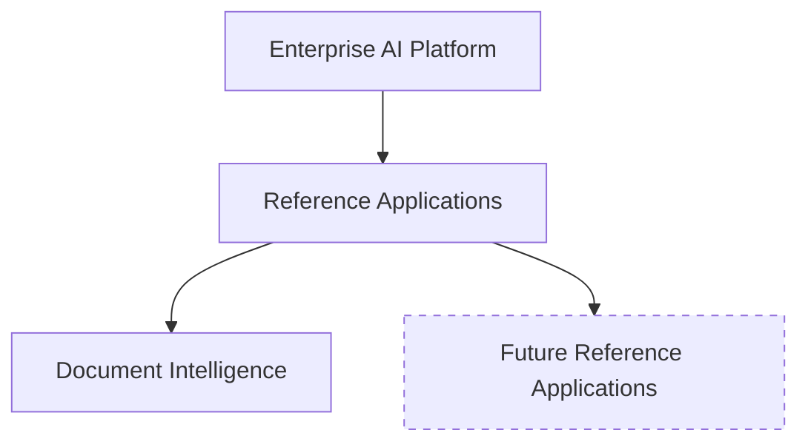

# Enterprise AI Platform v1.0.0

**First Public Release** · July 4, 2026

---

## Overview

Enterprise AI Platform v1.0.0 is the first public release of a modular, local-first platform for building production-grade AI applications. It provides reusable infrastructure for combining Large Language Models, Retrieval-Augmented Generation, hybrid retrieval, semantic search, and knowledge graphs — all within a disciplined enterprise architecture.

The platform is built on nine compile-time-enforced Maven modules with clear dependency boundaries. AI providers sit behind a common Service Provider Interface. Prompts are versioned and auditable. Evaluation runs automatically on every generated answer. Infrastructure components degrade gracefully when unavailable — the platform starts with only PostgreSQL and layers on Qdrant, Neo4j, and Ollama as needed.

This release ships with the platform core and one reference application: **Document Intelligence** — a complete demonstration of ingestion, enrichment, hybrid retrieval, and AI-grounded answers with full explainability.

---

## Who is this for?

Enterprise AI Platform is built for teams that need more than a demo:

- **Software architects** evaluating patterns for AI-integrated enterprise systems
- **AI platform engineers** building reusable infrastructure across multiple use cases
- **Enterprise development teams** deploying AI on infrastructure they control
- **Organizations with data governance requirements** that preclude sending documents to external APIs
- **Technical decision makers** who want to understand the architecture before committing to it

This platform is intended for teams designing long-lived AI systems where maintainability, extensibility, and operational reliability are first-class requirements.

---

## Highlights

### AI Platform

- **Multi-provider orchestration** — Ollama and OpenAI-compatible providers behind a common SPI with 4-tier deterministic routing
- **Prompt & model management** — versioned prompt registry with variable substitution and audit trails; queryable model capability registry covering streaming, vision, JSON mode, embeddings, and reasoning
- **Automated evaluation** — grounding, faithfulness, and hallucination scoring on every generated answer
- **Explainability by default** — full inference metadata: provider, model, prompt version, retrieval strategy, timing, and source counts

### Knowledge Platform

- **Hybrid retrieval** — keyword, vector (Qdrant), and graph (Neo4j) search with weighted linear fusion, automatically selected by query intent
- **Semantic enrichment** — automatic entity, concept, and relationship extraction during ingestion
- **Knowledge graph** — auto-generated Neo4j graph with typed nodes, relationships, and full provenance
- **GraphRAG** — graph traversal augments retrieval with relationship-aware discovery

### Enterprise Platform

- **Modular monolith architecture** — 9 compile-time-enforced Maven modules, single deployable process
- **Local-first deployment** — runs entirely on local infrastructure; cloud providers are optional
- **Graceful degradation** — every external dependency is optional; the platform starts with only PostgreSQL
- **Observability** — Micrometer + Prometheus metrics, health indicators, correlation IDs on every request
- **Workflow engine** — configurable multi-step processes with registered phase handlers
- **Immutable audit log** — every action recorded with correlation IDs for full traceability

---

## Major Capabilities

### Document Ingestion & Processing

Upload documents in multiple formats. The platform extracts text, enriches content with semantic metadata, chunks documents for retrieval, and indexes them across keyword, vector, and graph stores. The workflow engine orchestrates the full lifecycle from upload to readiness.

### AI-Assisted Reasoning

Ask natural language questions against indexed document collections. The platform analyzes query intent, selects the appropriate retrieval strategy, orchestrates results from multiple search backends, assembles context, and generates grounded answers with inline citations. Every answer carries full provenance metadata.

### Hybrid Knowledge Retrieval

Keyword search, vector similarity, and knowledge graph traversal combine in a single query. Weighted linear fusion merges results from all three backends. Retrieval strategy selection is automatic — no manual configuration per query.

### Semantic Understanding

Documents are enriched during ingestion with typed entities (organizations, persons, locations, dates), domain concepts, and cross-document relationships. This structured layer improves retrieval quality beyond what keyword matching alone can achieve.

### Grounded, Explainable Answers

Every AI-generated answer includes source citations, confidence scores, and a complete inference trace — which provider, model, and prompt version were used; which retrieval strategy was selected; how many sources were consulted; how long each step took. Grounding, faithfulness, and hallucination scores are attached automatically.

### Privacy-First Deployment

All infrastructure runs locally. Ollama handles LLM inference without external API calls. Documents never leave the organization's network. PostgreSQL, Qdrant, and Neo4j all run on infrastructure you control.

### Extensible Provider Model

A common SPI abstracts AI backends. Add providers without changing application code. The deterministic router selects providers based on model prefix, declared capabilities, stated preference, and runtime availability.

---

## Architecture

The platform follows a **modular monolith** pattern — nine Maven modules with strict compile-time dependency boundaries, deployed as a single process.



Future reference applications — Contract Intelligence, Compliance Intelligence, Engineering Knowledge, Research Assistant — extend the platform without modifying its core.

| Module | Responsibility |
|--------|---------------|
| `platform-api` | Application assembly — REST controllers, DTOs, web UI |
| `platform-ai` | RAG orchestration, enrichment, evaluation, prompt & model registries |
| `platform-search` | Hybrid retrieval — keyword, vector, and graph search with fusion |
| `platform-document` | Document lifecycle, ingestion pipeline, versioning, storage abstraction |
| `platform-neo4j` | Auto-generated knowledge graph — entities, concepts, relationships |
| `platform-workspace` | Workspace management, document organization, analysis context |
| `platform-observability` | Micrometer metrics, health indicators, AI telemetry |
| `platform-auth` | JWT authentication, OAuth2 resource server, RBAC |
| `platform-audit` | Immutable audit log — leaf module with no downstream dependencies |

Dependency direction flows downward. `platform-api` depends on all modules; no module depends on `platform-api`. Additional domains are added through configuration, not core changes.

---

## Reference Application: Document Intelligence

Document Intelligence is the first reference application built on the platform. It demonstrates how reusable platform capabilities are assembled into a complete enterprise solution:

- **Ingestion** — Upload PDF, DOCX, and plain text. Automatic extraction, semantic enrichment, chunking, and indexing across all backends.
- **Retrieval** — Keyword, vector, and graph search unified behind a single API, with automatic strategy selection.
- **Reasoning** — Natural language questions produce grounded, cited answers with full inference traceability.
- **Explainability** — Every response carries provider, model, prompt version, retrieval strategy, timing, and source attribution.
- **Observability** — All interactions instrumented with metrics and audit events.
- **Resilience** — Disable Neo4j and graph search is skipped. Disable Qdrant and vector search falls back to keyword. Disable Ollama and the platform remains operational.

---

## Developer Experience

### Build & Run

```bash
git clone <repository-url>
cd enterprise-ai-platform

# Start infrastructure
docker compose up -d                    # PostgreSQL + Qdrant
docker compose --profile graph up -d     # + Neo4j for GraphRAG

# Build and run
mvn spring-boot:run -pl platform-api
```

**Requirements:** Java 21, Maven 3.x, Docker. Ollama is optional for local LLM inference.

### Configuration

All infrastructure is configuration-driven. Database URLs, Qdrant hosts, Neo4j connections, Ollama endpoints, and AI provider settings are externalized through `application.yml` with environment variable overrides. Sensible defaults target localhost for all services.

### Documentation

| Book | Audience |
|------|----------|
| Architecture Handbook | Architects, Staff Engineers, Principal Engineers — design philosophy, trade-offs, lessons learned |
| Architecture & Engineering Handbook | Senior Engineers, Platform Engineers — complete technical reference with C4 diagrams |
| Architecture Decision Records (20 ADRs) | Architects, Principal Engineers — permanent record of every major engineering decision |
| Architecture Manual | All audiences — platform overview and design rationale |
| Developer Guide | Developers, Contributors — build, run, extend, test, debug, contribute |
| AI & LLM Fundamentals Guide | Engineers new to AI — LLM concepts and production patterns |

### Testing

Comprehensive automated testing across unit, integration, architecture, contract, and browser-based UI layers. All tests run in CI against a PostgreSQL service container.

```bash
mvn verify                        # unit + integration + architecture + contract
mvn verify -Pui-tests             # + Playwright browser tests
```

---

## Quality

- **Compile-time module boundaries** — Maven enforces dependency direction; circular dependencies are structurally impossible
- **Provider SPI with contract tests** — every provider implementation is protected by behavioral contracts
- **Graceful degradation** — missing infrastructure disables features gracefully; the platform never hard-fails on an unavailable dependency
- **Immutable audit log** — every action recorded with correlation IDs for full traceability
- **Observability by default** — Micrometer metrics on every AI operation: inference duration, embedding latency, retrieval results, enrichment throughput
- **Architecture Decision Records** — 20 ADRs documenting why each major decision was made, alternatives considered, and consequences accepted
- **C4 architecture diagrams** — system context, container architecture, module dependencies, inference pipeline, GraphRAG retrieval, and provider SPI — hand-authored SVG
- **Continuous Integration** — GitHub Actions workflow with PostgreSQL service container

---

## Known Limitations

- **Single reference application.** The platform currently ships with Document Intelligence as the sole reference implementation. Additional domains (contract analysis, compliance, financial review) are planned.
- **GraphRAG is foundational, not exhaustive.** The knowledge graph auto-generation and graph-enhanced retrieval work end-to-end, but advanced graph traversal strategies and multi-hop reasoning continue to evolve.
- **In-memory workflow engine.** The workflow engine is in-memory and designed for single-process deployment. Persistent workflow state and distributed execution are roadmap items.
- **No multi-tenancy.** The platform serves a single tenant. Multi-tenant isolation is planned for a future release.
- **Provider ecosystem.** Ollama and OpenAI-compatible providers are implemented. Additional providers (Anthropic, AWS Bedrock, Google Vertex AI) are community contributions or planned additions.
- **Flyway migrations disabled.** The current configuration uses JPA DDL auto-update for development convenience. Production deployments should enable Flyway with reviewed migration scripts.

---

## Roadmap

- **Enterprise connectors** — SharePoint, Confluence, Google Drive, S3 document sources
- **Additional reference applications** — Contract Intelligence, Compliance Intelligence, Financial Intelligence
- **Agentic workflows** — multi-step autonomous reasoning with tool use and verification loops
- **Knowledge Graph expansion** — advanced graph traversal, multi-hop reasoning, subgraph extraction
- **Additional AI providers** — Anthropic, AWS Bedrock, Google Vertex AI, Azure OpenAI
- **Workflow persistence** — durable workflow state with resume and replay
- **Multi-tenancy** — tenant-isolated document collections, vector collections, and knowledge graphs
- **Performance optimization** — embedding caching, retrieval result caching, batch ingestion improvements

---

## Acknowledgements

Enterprise AI Platform is built on an exceptional open-source foundation:

- **[Spring Boot](https://spring.io/projects/spring-boot)** — application framework, security, data access, and Actuator
- **[Neo4j](https://neo4j.com/)** — graph database powering the knowledge graph and GraphRAG
- **[Qdrant](https://qdrant.tech/)** — vector database for semantic search and similarity retrieval
- **[PostgreSQL](https://www.postgresql.org/)** — primary relational store with pgvector extension
- **[Ollama](https://ollama.com/)** — local LLM inference and embedding generation
- **[Apache Tika](https://tika.apache.org/)** — document format parsing and text extraction
- **[Micrometer](https://micrometer.io/)** — application observability and metrics
- **[Docker](https://www.docker.com/)** — containerized infrastructure deployment
- **[Playwright](https://playwright.dev/)** — browser-based UI testing

Thank you to the maintainers of every dependency in the supply chain.

---

## Why Enterprise AI Platform?

Most enterprise AI projects begin as demos — a notebook, a script, a prototype — and collapse under production demands because the architecture was never the starting point. Enterprise AI Platform begins with the architecture: nine compile-time-enforced modules, a provider SPI that makes AI backends swappable, versioned prompts with audit trails, automated evaluation on every answer, and graceful degradation when infrastructure is unavailable.

This distinction determines what happens next. A RAG application can only ever be a RAG application — adding contract analysis means forking the codebase. A platform accepts new domains through configuration. Document Intelligence proves the platform works; it does not define the platform's ceiling.

The platform is local-first by design. PostgreSQL, Qdrant, Neo4j, and Ollama run on infrastructure you control. Documents stay on your network. Inference happens on your hardware. Enterprise AI adoption is constrained less by model capability than by data governance, and a platform that requires sending sensitive documents to external APIs has already limited its addressable use cases.

The documentation reflects the same philosophy — six books, twenty Architecture Decision Records, six hand-authored C4 diagrams. Every major decision is explained: what was chosen, what was rejected, and why. The documentation is written for the architect who inherits this codebase three years from now.

**This is v1.0.0.** Some capabilities are foundational and will deepen over subsequent releases. The architecture, the abstractions, the testing strategy, and the documentation establish the patterns that future development will follow. The platform is ready for production evaluation, architecture review, and the reference applications beyond Document Intelligence that will follow.

Enterprise AI Platform provides the architectural foundation for building production-grade AI applications. Document Intelligence demonstrates those capabilities today. Future reference applications extend them without changing the platform itself.
