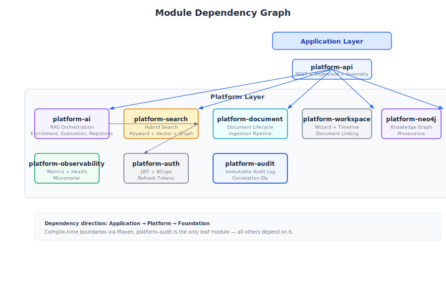
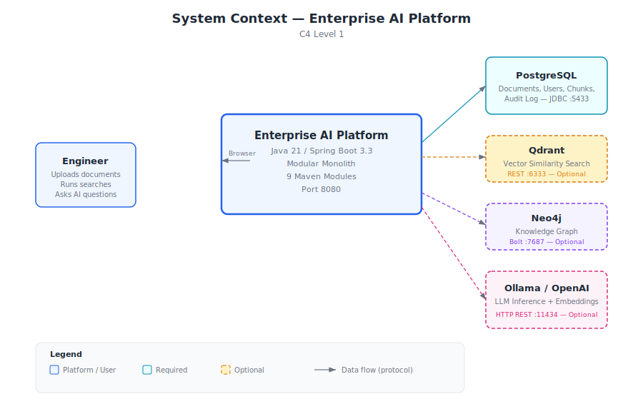
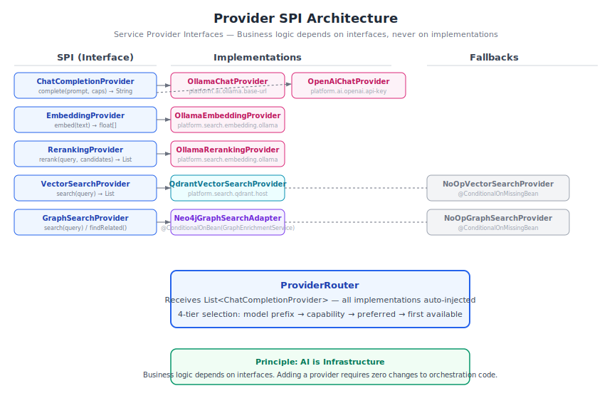

# Enterprise AI Platform — Architecture & Engineering Handbook

**Version 4.0 — June 2026**

---

> **Who this handbook is for.** Staff Engineers, Principal Engineers, and Architects who need to understand not just *what* the platform does, but *why* it was designed this way. If you're extending the platform, joining the project, or evaluating whether to build on it, start here.

---

## Table of Contents

1. [Why This Platform Exists](#1-why-this-platform-exists)
2. [The Principles That Shape Every Decision](#2-the-principles-that-shape-every-decision)
3. [How the Platform Fits Together](#3-how-the-platform-fits-together)
4. [The Document Journey: From Upload to Answer](#4-the-document-journey)
5. [How AI Is Wired In](#5-how-ai-is-wired-in)
6. [Why Semantic Enrichment Matters](#6-why-semantic-enrichment-matters)
7. [GraphRAG: When Vectors Aren't Enough](#7-graphrag-when-vectors-arent-enough)
8. [The Retrieval Decision Layer](#8-the-retrieval-decision-layer)
9. [Prompts as Engineering Assets](#9-prompts-as-engineering-assets)
10. [Models as Infrastructure](#10-models-as-infrastructure)
11. [Workflows Without Hardcoding](#11-workflows-without-hardcoding)
12. [Explainability: The Audit Trail](#12-explainability-the-audit-trail)
13. [Observing What Happens](#13-observing-what-happens)
14. [Security Decisions](#14-security-decisions)
15. [How We Test This](#15-how-we-test-this)
16. [Deploying the Platform](#16-deploying-the-platform)
17. [Extending the Platform](#17-extending-the-platform)
18. [Performance: What We Know](#18-performance-what-we-know)
19. [The Trade-offs We Accepted](#19-the-trade-offs-we-accepted)
20. [What We Learned Building This](#20-what-we-learned-building-this)
21. [Where This Goes Next](#21-where-this-goes-next)

**Appendices**
- [A: Architecture Decision Records](#appendix-a)
- [B: Glossary](#appendix-b)
- [C: References](#appendix-c)

---

## 1. Why This Platform Exists

### The Problem with AI Demos

Most AI projects start the same way: a Python script calls an LLM API, someone demos it, and it works — on a laptop, with one document, for one happy path. Then an engineer asks: "What happens when Qdrant is down?" Or: "Which prompt version generated this answer?" Or: "How do I add Anthropic alongside Ollama without rewriting the retrieval code?"

These questions expose the gap between an AI demo and an AI platform.

The Enterprise AI Platform closes that gap. It demonstrates how a team of experienced engineers would integrate AI into enterprise software: with clear module boundaries, swappable provider backends, versioned prompts, automatic quality evaluation, and graceful degradation when infrastructure fails.

### What This Platform Is — and Isn't

This is a **reusable modular monolith** — 9 Maven modules that compile into a single deployable Spring Boot application. It provides the infrastructure for building AI-powered applications: retrieval-augmented generation, semantic enrichment, knowledge graph construction, multi-provider orchestration, and production observability.

It is not a SaaS product. It is not a chatbot framework. It is a foundation — a set of patterns, interfaces, and working implementations that another engineering team could adopt as the starting point for their own AI application.

### What's In Scope

Multi-provider AI (Ollama, OpenAI-compatible), hybrid search (keyword + vector + graph), automatic semantic enrichment during ingestion, GraphRAG with Neo4j traversal, a versioned prompt registry, a queryable model capability database, automated evaluation of every AI answer, full explainability metadata, a reusable workflow engine, production metrics via Micrometer, and 157 automated tests.

### What's Deliberately Out

Microservices (the modular monolith enforces boundaries at compile time, not over the network), multi-agent systems, model fine-tuning, user management, billing. These are valid concerns but would distract from the core architecture.

> **Design Rationale:** Modular Monolith over Microservices — see [ADR-001](#adr-001-modular-monolith). Compile-time boundaries enforce dependency direction without distributed systems complexity. Modules can be extracted into services later if needed.

---

## 2. The Principles That Shape Every Decision

Eight principles govern every architectural choice. When a proposal conflicts with a principle, it's either rejected or the principle is amended with explicit rationale.

### 2.1 AI Is Infrastructure

> Treat LLMs, embedding models, vector databases, and knowledge graphs the way you treat PostgreSQL: abstract them behind interfaces, select them via configuration, swap them without changing business logic.

A `DocumentService` never calls `Ollama`. It calls `EnrichmentService`. Whether enrichment runs on Ollama, OpenAI, or a regex fallback is an infrastructure concern, not a business logic concern. This pattern repeats across every module.

### 2.2 Graceful Degradation, Not Hard Failures

Every external dependency is optional. The platform starts with only PostgreSQL. Add Qdrant, and vector search activates. Add Neo4j, and the knowledge graph populates. Add Ollama, and LLM inference runs. Remove any of them, and the platform continues — with reduced capabilities, logged clearly, never silently.

This was not an afterthought. Conditional beans (`@ConditionalOnProperty`), `ObjectProvider<T>` injection, `NoOp*` fallback implementations, and `isAvailable()` checks are designed into every provider boundary.

> **Operational Note:** Health indicators for Ollama, Qdrant, and AI providers are exposed at `/actuator/health`. If a service is down, the health endpoint shows it, metrics record it, and logs explain why — but the platform keeps running.

### 2.3 Explainability by Default

Every AI response carries metadata describing exactly how it was produced: which intent was classified, which retrieval strategy was selected, which prompt template (and version) was used, which provider and model generated the answer, how many chunks and graph nodes were retrieved, and what evaluation scores were computed.

This is not a feature toggle. It is built into the orchestration layer. If the platform generates an answer, it can explain itself.

### 2.4 Documents Are the Knowledge Source

Knowledge is extracted from documents automatically during ingestion. There is no manual knowledge base, no CRUD interface for entities. The enrichment engine extracts entities, concepts, and relationships. The knowledge graph is auto-generated. Users upload documents — the platform builds the knowledge.

This was a deliberate departure from earlier designs that included a manual knowledge base. That module was removed in Phase 1. The document corpus is the knowledge source.

### 2.5 Domain Independence

The platform core contains no assumptions about legal documents, financial reports, or any industry. Domain customization happens through the `DomainConfiguration` SPI. The Document Intelligence reference application provides default configurations. New domains add their own.

### 2.6–2.8

**Testing as Architecture Documentation:** Tests validate behavior, not implementation. A Staff Engineer should understand the platform by reading the test suite.

**Production Readiness:** Observability, health checks, and configuration are first-class concerns — not afterthoughts bolted on before release.

**Modular Monolith:** Module boundaries are enforced at compile time. The dependency graph is directional. Higher-level modules depend on lower-level APIs, never the reverse.

> **Related:** All eight principles are documented as individual ADRs in [Appendix A](#appendix-a).

---

## 3. How the Platform Fits Together

### 3.1 The Module Graph



**Figure 3.1.** Nine Maven modules organized in three layers. Application (`platform-api`) depends on Platform modules, which depend on Foundation (`platform-audit`). Arrows show compile-time dependency direction.

The platform is organized in three layers:

- **Foundation:** `platform-audit` is the only leaf module — every other module depends on it. It provides immutable audit logging with correlation IDs that thread through every request.
- **Platform:** Seven modules provide the platform's capabilities: authentication (`platform-auth`), document lifecycle (`platform-document`), hybrid search (`platform-search`), AI orchestration (`platform-ai`), Neo4j graph persistence (`platform-neo4j`), workspace management (`platform-workspace`), and observability (`platform-observability`).
- **Application:** `platform-api` wires everything together — REST controllers, Thymeleaf templates, DTOs, and the `SearchInfrastructureConfig` that conditionally activates provider beans.

Each module has a single responsibility. When a module grows large (as `platform-ai` has), its internal package structure provides further separation without adding Maven modules.

### 3.2 The System and Its Dependencies



**Figure 3.2.** The platform communicates with four external systems. PostgreSQL is required. Qdrant, Neo4j, and Ollama/OpenAI are optional — the platform degrades gracefully when any are unavailable.


**Figure 3.3.** Runtime containers: a single Spring Boot process (port 8080) communicates with PostgreSQL (5433), Qdrant (6333/6334), Neo4j (7687), and an LLM backend (11434) via standard protocols.

### 3.3 Technology Choices

Spring Boot 3.3 with Java 21 was chosen for its mature ecosystem (security, JPA, scheduling, Actuator), virtual thread support, and familiarity to enterprise teams. Every dependency version is managed through the Spring Boot BOM — only three libraries (PDFBox, POI, JSoup) are pinned explicitly because they're not in the BOM.

> **Trade-off:** Spring Boot vs Quarkus. Spring Boot has slower startup but a richer ecosystem and broader enterprise familiarity. See [ADR-002](#adr-002-spring-boot).

---

## 4. The Document Journey: From Upload to Answer

### 4.1 The Engineering Problem

Documents arrive as PDFs, DOCX files, or plain text. Before an AI can reason about them, the platform must extract clean text, split it into searchable chunks, generate vector embeddings, extract structured knowledge (entities, concepts, relationships), and persist everything to the right stores — all without blocking the upload request.

The pipeline must also handle the reality that infrastructure may be partially available. No Qdrant? Vector search should still work via keyword fallback. No LLM? Enrichment should still run via regex patterns. No Neo4j? The graph is skipped, not failed.

### 4.2 The Pipeline


**Figure 4.1.** Document ingestion runs asynchronously. Upload creates a PENDING job. A scheduled worker picks it up every 10 seconds. Text extraction, enrichment, chunking, and embedding run sequentially. Results land in PostgreSQL, Qdrant, and Neo4j.

The pipeline runs asynchronously through a scheduled worker, not during the HTTP request. This is deliberate: document processing can take seconds to minutes, and HTTP request threads shouldn't block that long.

**Step 1 — Upload.** An HTTP POST creates a `Document` entity and a `PENDING` `IngestionJob`. The user gets an immediate response.

**Step 2 — Polling.** `DocumentIngestionWorker` fires every 10 seconds, picks up the top 10 pending jobs, and processes each through `DefaultDocumentIngestionProcessor`.

**Step 3 — Extraction.** `TextExtractionService` dispatches to the right parser: Apache PDFBox for PDFs, Apache POI for DOCX, JSoup for HTML, plain text otherwise.

**Step 4 — Enrichment.** Before chunking, `EnrichmentHook` runs semantic enrichment: entity extraction (organizations, persons, technologies), concept detection (temporal, financial, domain-specific), and relationship extraction. If an LLM is available, it runs the `entity-extraction/v1` prompt for higher quality. Otherwise, regex patterns provide a baseline. Results are bridged to Neo4j through `GraphEnrichmentService`.

**Step 5 — Chunking.** `SentenceAwareChunkingStrategy` splits text at sentence boundaries with a 1200-character target, 200-character minimum, and 150-character overlap.

**Step 6 — Embedding.** `OllamaEmbeddingProvider` generates 768-dimensional vectors via the Ollama API. If no embedding provider is configured, chunks are stored keyword-only.

**Step 7 — Persistence.** Chunks land in PostgreSQL (JPA), vectors in Qdrant (REST API), and graph nodes in Neo4j (Bolt protocol). Each store is optional beyond PostgreSQL.

> **Lesson Learned:** Enrichment runs *before* chunking, not after. This was discovered during testing — enriching full document text produces higher-quality entity extraction than enriching individual chunks. Context matters for entity disambiguation.

---

## 5. How AI Is Wired In

### 5.1 The Engineering Problem

An AI-powered question-answering system is not just "call the LLM." It requires: classifying the user's intent (are they inspecting the index, or asking a substantive question?), selecting the right retrieval strategy, retrieving relevant chunks from potentially multiple sources, assembling them into a coherent context, selecting the right prompt template, choosing which AI provider and model to use, calling the LLM, validating the answer for temporal consistency and citation accuracy, grounding it in the retrieved sources, and evaluating its quality.

Each of these steps must be observable, auditable, and individually replaceable.

### 5.2 The Pipeline


**Figure 5.1.** Twelve steps from user query to structured answer. Every step produces metadata for the explainability trail. Steps 7-9 (validation, grounding, evaluation) run even when earlier steps produce warnings.

The pipeline flows through twelve stages, each producing metadata for the explainability trail:

1. **Intent Classification.** `QueryIntentClassifier` determines whether this is an index inspection (routed to keyword-only) or a substantive question (routed through full RAG).

2. **Strategy Selection.** `RetrievalOrchestrator` maps the classified intent to a retrieval strategy: keyword for exact lookups, hybrid for complex questions, semantic for conceptual exploration.

3. **Retrieval.** `RetrievalAugmentationService` executes search through `SearchFacade`, which fans out to keyword, vector, and optionally graph search, then fuses and reranks the results.

4. **Context Assembly.** Retrieved chunks, authority references, and analysis objectives are assembled into a `PromptContext`.

5. **Prompt Building.** The `PromptRegistry` resolves `rag-answer/v1`, the `PromptBuilder` renders it with the context and question substituted.

6. **Provider Selection.** The `ProviderRouter` selects which `ChatCompletionProvider` to use — Ollama, OpenAI, or whichever provider is available and appropriate.

7. **LLM Inference.** The selected provider generates the raw answer text.

8. **Validation.** `TemporalConsistencyValidator` checks that dates in the answer don't hallucinate. `ClaimValidator` checks that claims cite available sources.

9. **Grounding.** `GroundingService` re-attributes sources, computes a multi-dimensional `ConfidenceProfile`.

10. **Evaluation.** `EvaluationService` computes grounding score, faithfulness, hallucination indicators, and a pass/fail quality gate.

11. **Explainability.** Every decision from steps 1-10 is captured in `RetrievalOrchestrationResult` — traceable, auditable, deterministic.

12. **Response.** `AiResponse` wraps the reasoned answer with full metadata.

### 5.3 The Provider Architecture



**Figure 5.2.** Five SPIs separate business logic from infrastructure. Each implementation activates conditionally. NoOp fallbacks ensure the platform works without any optional service.

> **Extension Note:** Adding a new LLM provider requires implementing `ChatCompletionProvider`, adding `@Component` + `@ConditionalOnProperty`, and registering the model's capabilities. The `ProviderRouter` discovers it automatically via `List<ChatCompletionProvider>` injection. Zero orchestration code changes.

---

## 6. Why Semantic Enrichment Matters

### 6.1 The Engineering Problem

Keyword search finds exact matches. Vector search finds semantically similar passages. Neither understands that "Acme Corporation" is an organization, or that "$45.2 million" is related to "revenue," or that "Dr. Sarah Chen" signed a document dated "January 15, 2026."

This structured understanding — who, what, when, how much — is what enables intelligent retrieval. A query like "What contracts did Acme sign in Q2?" should find documents mentioning "Acme Corporation" as a party, with dates in Q2 2026, containing financial obligations — even if the exact words don't appear.

### 6.2 The Approach

Enrichment runs automatically during ingestion. No user manually creates knowledge entries. The document corpus is the knowledge source.

The `EnrichmentService` SPI supports two extraction modes:

- **LLM-based:** When a `ChatCompletionProvider` is available, the `entity-extraction/v1` prompt extracts entities, concepts, and relationships with high accuracy.
- **Regex fallback:** When no LLM is available, regex patterns for organizations, persons, dates, and monetary amounts provide a baseline that works without infrastructure.


**Figure 6.1.** Enrichment runs after text extraction and before chunking. Results flow to Neo4j through `EnrichmentHook`. When Neo4j is unavailable, enrichment still runs but graph persistence is skipped.

### 6.3 Provenance

> **Design Rationale:** Every graph node carries provenance. Without it, a node claiming "Acme Corporation is an ORGANIZATION" could be a hallucination. With provenance, you can trace it back to the exact document, chunk, extraction model, prompt version, and timestamp. This makes the knowledge graph auditable.

Every node and relationship carries `NodeProvenance`: source document ID, chunk ID, extraction confidence (0-1), extraction timestamp, extraction model (or "regex"), prompt version, and provider. This is not optional metadata — it is the foundation of trust in the knowledge graph.

> **Trade-off:** LLM extraction is more accurate than regex patterns but adds latency and requires an LLM. The dual-mode approach was chosen over LLM-only because basic entity extraction should work without any AI infrastructure.

---

## 7. GraphRAG: When Vectors Aren't Enough

### 7.1 The Engineering Problem

Traditional RAG retrieves chunks by keyword and vector similarity. But documents can be semantically related without sharing keywords or embedding proximity. A contract signed by Acme Corporation and a financial report mentioning Acme's Q2 revenue are related — but their chunk embeddings may be far apart in vector space.

A knowledge graph captures these relationships explicitly: `Document A MENTIONS Organization:Acme`, `Document B MENTIONS Organization:Acme`. Traversing the graph reveals connections that vector search misses.

### 7.2 The Approach

GraphRAG adds graph traversal as a third retrieval source alongside keyword and vector. It does not replace them — it augments them.


**Figure 7.1.** Three retrieval sources feed into weighted linear fusion. Graph results boost existing candidates rather than competing with them. The graph path is optional — when Neo4j is unavailable, retrieval continues with keyword and vector.

The key design decision: **graph results boost, not replace.** The `combineWithGraph()` method adds up to 15% score increase for candidates that have related graph nodes. A document that ranks #15 by keyword+vector could move to #5 because it mentions the same entities as a top-ranked document.

The `Neo4jGraphSearchAdapter` bridges `GraphEnrichmentService` (in the Neo4j module) to `GraphSearchProvider` (the search module's SPI). This adapter exists in `platform-api` because it's an assembly concern — it wires together two modules that shouldn't depend on each other directly.

> **Lesson Learned:** GraphRAG was documented as a feature for months before it was actually implemented. The architecture manual described Neo4j participating in retrieval, but the code used `NoOpGraphSearchProvider` as a permanent fallback. Building the `Neo4jGraphSearchAdapter` closed the gap between documentation and implementation. Document what *is* built, not what *should be* built.

> **Operational Note:** Graph search is activated by `SearchMode.GRAPH` or `SearchMode.HYBRID_GRAPH`. When Neo4j is unavailable, `NoOpGraphSearchProvider` returns empty results and the fusion layer handles it gracefully — keyword and vector results are unaffected.

---

## 8. The Retrieval Decision Layer

### 8.1 The Engineering Problem

Not all queries benefit from all retrievers. An index inspection query ("what documents are indexed?") should use keyword-only — running vector search wastes resources. A conceptual question ("what capabilities does this platform have?") benefits from vector similarity. A complex analytical question benefits from hybrid search with graph augmentation.

Running every retriever for every query is wasteful. The solution is a decision layer that selects the retrieval strategy based on classified intent.

### 8.2 The Approach


**Figure 8.1.** Query intent drives strategy selection deterministically. INDEX_INSPECTION routes to keyword-only. QUESTION_ANSWERING routes to hybrid. DOCUMENT_LOOKUP routes to semantic. Every decision is logged in the trace.

The `RetrievalOrchestrator` implements a deterministic decision tree:

| Intent | Strategy | Rationale |
|--------|----------|-----------|
| INDEX_INSPECTION, CORPUS_DISCOVERY | KEYWORD | Exact match queries; vector unnecessary |
| QUESTION_ANSWERING, WORKSPACE_ANALYSIS | HYBRID | Complex queries benefit from keyword + vector |
| DOCUMENT_RESEARCH, DOCUMENT_LOOKUP | SEMANTIC | Conceptual queries benefit from vector similarity |

> **Design Rationale:** Deterministic over ML-based routing. A keyword-based intent classifier is less accurate than a trained model but is deterministic, explainable, and sufficient for the current query types. The architecture supports replacing the classifier without changing the orchestrator.

The fusion algorithm uses weighted linear combination, not Reciprocal Rank Fusion. This is a deliberate choice: RRF requires rank positions from each retriever, which aren't always available (graph search returns discovery results, not ranked lists). Weighted linear fusion works with raw scores and is simpler to explain.

```
score = (keyword×0.40 + vector×0.40 + confidence×0.20) × docTypeWeight + graphBoost
```

> **Trade-off:** Weighted linear fusion vs RRF. RRF would produce more theoretically sound rankings when rank data is available. Weighted linear fusion is more practical when retrievers produce heterogeneous scores. The fusion method is accurately named — we don't claim to implement RRF.

---

## 9. Prompts as Engineering Assets

### 9.1 The Engineering Problem

Prompts scattered across Java string constants are invisible, unversioned, and untestable. When a prompt changes, there's no audit trail. When a new domain requires different instructions, there's no way to provide them without changing code.

Prompts are engineering assets — they need the same versioning, discoverability, and audit trails as source code.

### 9.2 The Approach

The `PromptRegistry` stores versioned prompt templates with categories, variables, expected output types, supported models, recommended temperature, and usage examples. Every prompt has a qualified ID (`rag-answer/v1`) that is recorded in inference metadata.

Nine categories organize prompts by purpose: RETRIEVAL, SUMMARIZATION, EXTRACTION, CLASSIFICATION, EVALUATION, REASONING, WORKFLOW, GRAPH, SEARCH, SYSTEM.

The default registry seeds eight prompts. Production deployments would load prompts from YAML resources or a database. The `render()` method substitutes `{{variable}}` placeholders — simple, predictable, no template engine dependency.

> **Lesson Learned:** Prompt versioning proved essential during testing. When we changed the `rag-answer` system instructions, we could compare evaluation scores between v1 and v2 — an A/B test for prompts. Without versioning, prompt changes are invisible and their effects are discovered in production.

---

## 10. Models as Infrastructure

### 10.1 The Engineering Problem

Different models have different capabilities. GPT-4o supports vision and structured output. nomic-embed-text only does embeddings. qwen2.5:7b is fast and local but lacks vision support. Business logic should not hardcode assumptions like "this model supports JSON mode."

When multiple providers are available, the platform should select intelligently — not just pick the first available.

### 10.2 The Approach

The `ModelCapabilityRegistry` describes every known model across eight capability dimensions: streaming, vision, JSON mode, tool calling, embeddings, reasoning, structured output. Plus quantitative metadata: context window, output tokens, latency estimates, cost estimates, recommended temperature, preferred use cases.

The `ProviderRouter` uses a four-tier selection strategy:

1. **Model prefix:** `openai:gpt-4o` routes to the OpenAI provider
2. **Capability match:** Request `STREAMING` → find a provider with a streaming-capable model
3. **Preferred provider:** Explicit preference from the caller
4. **First available:** The first provider reporting `isAvailable() == true`

> **Design Rationale:** The router receives `List<ChatCompletionProvider>` — Spring injects all available implementations automatically. Adding a provider means implementing the interface and adding `@Component`. The router discovers it without code changes.


**Figure 10.1.** Four-tier provider selection. Each tier is logged. If all tiers fail, `IllegalStateException` is thrown — the platform never silently degrades to an unknown provider.

---

## 11. Workflows Without Hardcoding

### 11.1 The Engineering Problem

Document intelligence involves multi-step processes: upload → extract → enrich → chunk → index → review → complete. Hardcoding these steps in a controller couples process logic to HTTP concerns and prevents reuse.

### 11.2 The Approach

The `WorkflowEngine` separates process definition from execution. A `WorkflowDefinition` declares steps and transitions. A `WorkflowInstance` tracks current state. The engine provides five methods: `start`, `advance`, `previous`, `findInstance`, `listActive`.

Two pre-registered workflows demonstrate the concept: `document-intelligence` (SETUP→INGESTION→ANALYSIS→REVIEW→COMPLETE) and `batch-ingestion` (INGEST→ENRICH→COMPLETE). Steps declare handler types (manual, automated, ai) as extension points.

The current implementation is in-memory — suitable for a single-node reference implementation. A database-backed store would be needed for production durability.

> **Extension Note:** Adding a workflow means defining steps and transitions, then calling `workflowEngine.start("my-workflow", context)`. No controller changes, no database migrations. The engine handles state transitions.

---

## 12. Explainability: The Audit Trail

Every AI inference produces a `RetrievalOrchestrationResult` that records: the classified intent, the selected retrieval strategy, which prompt template and version was used, which provider and model generated the answer, how many keyword/vector/graph results were retrieved, the fusion method, whether reranking was applied, evaluation scores, and a human-readable `explain()` summary.

This is not a feature flag. It is built into the orchestration layer. The metadata is generated during normal execution — there's no separate "explain this" pass.

> **Design Rationale:** Explainability is infrastructure, not a feature. Building it into the orchestrator ensures consistency — every code path produces metadata. Bolting it on as a separate service would mean some paths don't record metadata.

---

## 13. Observing What Happens

The `platform-observability` module provides Micrometer metrics for every AI operation: inference duration (with provider/model tags and percentile histogram), embedding duration, retrieval duration, graph retrieval duration, enrichment duration, ingestion duration, prompt execution tokens, provider availability gauges, and evaluation score summaries.

Health indicators check Ollama, Qdrant, and AI provider availability at `/actuator/health`. Metrics export to Prometheus at `/actuator/prometheus`.

> **Operational Note:** The `AiMetrics` component is ready but not yet fully wired into all services. This is intentional — the metric definitions are stable, but the integration points are documented as future work.

---

## 14. Security Decisions

Authentication uses JWT (HS256) with BCrypt-12 password hashing. Refresh tokens are SHA-256 hashed before storage and rotated on use. Both stateless API auth (Bearer token) and session-based form login are supported.

Provider API keys are never hardcoded — they're injected via `${ENV_VAR}` substitution in `application.yml`. User input is injected as `{{question}}` into vetted prompt templates, and HTML-escaping in controller responses prevents XSS.

---

## 15. How We Test This

The test suite is organized as executable architecture documentation. A Staff Engineer should understand the platform by reading the tests.


**Figure 15.1.** Five testing layers from unit to browser. The default `mvn verify` runs unit, integration, architecture, and resilience tests. Playwright tests use a separate Maven profile.

| Layer | Count | What It Validates |
|-------|-------|-------------------|
| Unit | 44 | Individual components in isolation — Prompt Registry, Provider Router, Model Registry |
| Integration | 91 | Subsystem interaction with real Spring context |
| Architecture | 10 | End-to-end behavioral validation — enrichment, retrieval, evaluation |
| Resilience | 9 | Graceful degradation — provider fallback, graph unavailable |
| Contract | 5 | SPI stability — every `ChatCompletionProvider` must satisfy the abstract contract |
| Playwright | 12 | Browser user journeys (separate profile: `mvn verify -Pui-tests`) |

Tests describe behavior, not implementation: "routes openai:gpt-4o to openai provider," not "testProviderRouter."

---

## 16. Deploying the Platform

Requirements: Java 21, PostgreSQL (required, port 5433), Qdrant (optional, port 6333), Neo4j (optional, port 7687), Ollama (optional, port 11434).

```bash
docker compose up -d                        # PostgreSQL + Qdrant
docker compose --profile graph up -d        # + Neo4j
mvn spring-boot:run -pl platform-api        # Start platform on :8080
```

All configuration uses `application.yml` with `${ENV_VAR:default}` substitution. The `platform.*` prefix namespaces all custom configuration.


**Figure 16.1.** Production deployment with all services. Neo4j is in the `graph` Docker Compose profile and can be omitted. The platform starts with only PostgreSQL.

---

## 17. Extending the Platform

**Adding an LLM Provider:** Implement `ChatCompletionProvider`. Add `@Component` + `@ConditionalOnProperty`. Register the model's capabilities in `DefaultModelCapabilityRegistry`. The `ProviderRouter` discovers it automatically.

**Adding a Domain:** Implement `DomainConfiguration`. Provide as a Spring bean. Concept definitions, objectives, finding hierarchies, and system instructions become available to the AI pipeline.

**Adding a Workflow:** Define steps and transitions, call `workflowEngine.start()`. The engine handles state transitions.

**Adding a Prompt:** Call `promptRegistry.register(new PromptTemplate(...))`. The prompt is versioned, categorized, and discoverable.

---

## 18. Performance: What We Know

The platform has not been benchmarked — it's a reference implementation, not a production deployment. What we know from the architecture:

- Chunking is O(n) in document length with sentence-boundary awareness
- Embedding generation is sequential (parallelizable via virtual threads)
- Weighted fusion is O(k+v+g) where k,v,g are candidate counts from each retriever
- Graph traversal is limited to 2 hops (configurable)
- LLM inference timeout is configurable (default 120s)
- Ingestion processes 10 documents per polling cycle

No caching layer exists — each retrieval re-executes. This is appropriate for a reference implementation but would be the first optimization in production.

---

## 19. The Trade-offs We Accepted

| Decision | Chosen | Alternative | Why |
|----------|--------|-------------|-----|
| Architecture | Modular Monolith | Microservices | Compile-time boundaries sufficient; future extraction possible |
| Framework | Spring Boot 3.3 | Quarkus | Larger ecosystem; enterprise familiarity |
| Graph DB | Neo4j | RDF / pgvector | Cypher for traversal queries; schema flexibility |
| Fusion | Weighted linear | Reciprocal Rank Fusion | Heterogeneous retriever scores; simpler to explain |
| Prompts | Versioned registry | Inline strings | Audit trails; regression testing |
| Enrichment | Dual-mode (LLM+regex) | LLM-only | Works without AI infrastructure |
| Provider selection | 4-tier routing | Hardcoded | Zero-code provider addition |
| UI testing | Playwright | Selenium | Modern API; auto-waits; better developer experience |

> **Related:** Each decision is documented in detail in [Appendix A](#appendix-a).

---

## 20. What We Learned Building This

**Domain-specific code is easier to remove when interfaces are clean.** The original German tenancy law content (55 BGB paragraph references, 25+ German legal keywords) was removed without architectural changes — the interfaces had clean separation from the domain logic.

**Unused dependencies accumulate invisibly.** `spring-ai-ollama` and 5 transitive JARs sat on the classpath for months with zero imports. A regular `mvn dependency:analyze` run is worth its weight in disk space.

**Bean wiring tests are essential in Spring applications.** The entire AI pipeline — `AiService` with 12 collaborating services — compiled cleanly and passed all tests, but was never injected anywhere. The `AiPageController` only displayed retrieval results without generating LLM answers. A wiring verification test caught this.

**Document what is built, not what should be built.** GraphRAG appeared in the architecture manual months before the code implemented it. The `Neo4jGraphSearchAdapter` was built specifically to close this gap. Now the documentation reflects the code, not the other way around.

**Prompt versioning is table stakes for AI platforms.** What started as a simple registry became the foundation for deterministic behavior validation, A/B testing prompts, and audit trails. Every inference records exactly which prompt produced it.

**Tests as documentation works.** Evolving from 128 wiring-verification tests to 157 behavioral tests made the test suite readable by architects without reading the implementation. The test names describe the platform's behavior.

---

## 21. Where This Goes Next

**Done:** Modular monolith, multi-provider AI, prompt registry, model capability registry, semantic enrichment, GraphRAG, retrieval orchestration, evaluation, explainability, workflow engine, production observability, graceful degradation, DomainConfiguration SPI, 157 behavioral tests.

**Partially done:** DomainConfiguration SPI exists but 8 services still embed their configurations. AiMetrics is ready but not fully wired into all services. The workflow engine has no PhaseHandler implementations yet.

**Future:** Dynamic model capability discovery from provider APIs, Resilience4j integration (retry, circuit breaker), OpenTelemetry distributed tracing, streaming LLM responses, prompt A/B testing, automated evaluation regression testing, Spring Modulith runtime verification.

---

## Appendix A — Architecture Decision Records

Twenty Architecture Decision Records document every major engineering decision. Each follows the standard format: Context, Decision, Alternatives Considered, Consequences, Trade-offs, Future Evolution.

### ADR Index

| ADR | Title | Status | Category |
|-----|-------|--------|----------|
| 001 | Modular Monolith | Accepted | Architecture |
| 002 | Spring Boot 3.3 | Accepted | Technology |
| 003 | Provider SPI | Accepted | AI Infrastructure |
| 004 | Provider Router | Accepted | AI Infrastructure |
| 005 | Prompt Registry | Accepted | AI Infrastructure |
| 006 | Model Capability Registry | Accepted | AI Infrastructure |
| 007 | Semantic Enrichment | Accepted | Knowledge |
| 008 | GraphRAG | Accepted | Knowledge |
| 009 | Neo4j | Accepted | Knowledge |
| 010 | Qdrant | Accepted | Knowledge |
| 011 | Retrieval Orchestration | Accepted | Knowledge |
| 012 | Explainability | Accepted | Quality |
| 013 | Evaluation Engine | Accepted | Quality |
| 014 | Workflow Engine | Accepted | Extensibility |
| 015 | AI Observability | Accepted | Operations |
| 016 | Graceful Degradation | Accepted | Operations |
| 017 | DomainConfiguration | Accepted | Extensibility |
| 018 | Provenance Graph | Accepted | Knowledge |
| 019 | Testing Strategy | Accepted | Quality |
| 020 | Design Philosophy | Accepted | Governance |

---

## Appendix B — Glossary

**Capability** — A feature an AI model supports (streaming, vision, JSON mode, embeddings, tool calling).

**ChatCompletionProvider** — SPI for LLM backends. The platform's abstraction over Ollama, OpenAI, and future providers.

**Chunk** — A segment of document text (~1200 characters) stored and indexed for retrieval, with sentence-boundary awareness and overlap.

**Citation Coverage** — Fraction of AI answer claims that cite a retrieved source. Measured by `EvaluationService`.

**Context Window** — Maximum tokens a model can process in a single request. Ranges from 8K (nomic-embed-text) to 200K (Claude).

**DomainConfiguration** — SPI providing domain-specific rules: concepts, objectives, hierarchies, centrality weights, system instructions.

**Embedding** — A 768-dimensional vector representation of text, generated by an embedding model (typically nomic-embed-text).

**Enrichment** — Automatic extraction of entities, concepts, and relationships from documents during ingestion.

**Evaluation** — Automated quality assessment measuring grounding, faithfulness, hallucination indicators, answer relevance, and context relevance.

**Explainability** — Metadata describing exactly how an inference was produced: which model, prompt, strategy, and documents were used.

**Faithfulness** — How factually accurate an AI answer is relative to its source documents. Inverse of hallucination rate.

**Fusion** — Combining retrieval results from multiple sources (keyword, vector, graph) into a single ranked list.

**GraphRAG** — Retrieval-augmented generation enhanced with knowledge graph traversal. Graph results boost existing candidates.

**Grounding** — The degree to which an AI answer is supported by retrieved evidence. Measured by context-to-answer ratio.

**Hallucination** — AI-generated text not supported by source documents. Detected via uncertainty phrase patterns.

**Hybrid Search** — Retrieval combining keyword, vector, and optionally graph search.

**Inference** — The process of an LLM generating text from a prompt.

**Intent** — The classified purpose of a user query: question answering, document lookup, index inspection, etc.

**Knowledge Graph** — A network of entities, concepts, and relationships extracted from documents and stored in Neo4j.

**LLM** — Large Language Model. An AI model trained to generate text from prompts.

**Model Capability Registry** — Searchable database of model features, limits, latency estimates, and cost estimates.

**Modular Monolith** — Single deployable with compile-time module boundaries enforced by Maven.

**NodeProvenance** — Metadata linking a graph element to its source document, chunk, extraction model, prompt version, and timestamp.

**Observability** — Understanding system state through metrics (Micrometer), health checks (Actuator), and structured logging.

**Playwright** — Browser automation framework for end-to-end UI testing. Used instead of Selenium.

**Prompt** — A structured text template sent to an LLM to guide its response. Versioned in the Prompt Registry.

**Prompt Registry** — Versioned store of prompt templates organized by category with metadata for discovery and auditing.

**Provider** — An AI backend (Ollama, OpenAI) implementing a platform SPI.

**Provider Router** — Component selecting which provider to use for an inference request. 4-tier deterministic selection.

**Provenance** — Metadata linking data to its origin: source document, extraction method, model, prompt version, timestamp.

**Qdrant** — Vector database for high-dimensional similarity search. Optional infrastructure.

**RAG** — Retrieval-Augmented Generation. Grounding LLM responses in documents retrieved at query time.

**Registry** — A store of known entities (prompts, models, capabilities) with query capabilities and versioning.

**Reranking** — Reordering retrieval candidates to improve relevance. Two-stage: score sort + LLM cross-encoder (optional).

**Retrieval Strategy** — Selection of which retrievers to use based on classified query intent. Deterministic and explainable.

**Semantic Enrichment** — Automatic extraction of structured knowledge from text during document ingestion.

**SPI** — Service Provider Interface. A pluggable contract for extending the platform without modifying existing code.

**Streaming** — Real-time token-by-token LLM output. Not yet implemented.

**Structured Output** — LLM responses constrained to a specific format (JSON, function calls). Supported by GPT-4o and Llama 3.2.

**Token** — A unit of text processed by an LLM (~0.75 words in English).

**Tracing** — Following a request through all platform subsystems using a correlation ID.

**Vector** — A numerical representation of text meaning used for semantic similarity search. 768 dimensions in this platform.

**Vector Database** — Database optimized for high-dimensional similarity queries. Qdrant in this platform.

**Workflow** — A configurable multi-step process with defined state transitions. Executed by the Workflow Engine.

---

## Appendix C — References

### Engineering & Architecture
- **Spring Boot 3.3 Reference Documentation** — The platform's runtime framework
- **Martin Kleppmann — Designing Data-Intensive Applications** — Foundational thinking on data systems design
- **Martin Fowler — Patterns of Enterprise Application Architecture** — Patterns for modular design and dependency management
- **Simon Brown — C4 Model** — Architecture visualization approach used in our diagrams

### AI & Retrieval
- **Lewis et al. (2020) — Retrieval-Augmented Generation for Knowledge-Intensive NLP Tasks** — The foundational RAG paper
- **Microsoft Research (2024) — GraphRAG: From Local to Global** — Graph-enhanced retrieval for query-focused summarization
- **Neo4j Graph Data Science Documentation** — Graph algorithms for centrality and community detection
- **Qdrant Documentation** — Vector search with payload filtering

### Operations & Testing
- **Micrometer Documentation** — JVM metrics instrumentation
- **Prometheus Documentation** — Metrics collection and alerting
- **Playwright Documentation** — Cross-browser automation
- **OpenTelemetry** — Distributed tracing standard (future integration)

### Internal
- [TESTING.md](../TESTING.md) — Testing philosophy and execution guide
- [ADR Index](adr/INDEX.md) — Architecture Decision Record index
- [Diagram Inventory](diagrams/README.md) — SVG diagram index with style guide

### ADR-001-modular-monolith

<a name="ADR-001-modular-monolith"></a>

##### ADR-001 — Modular Monolith Architecture

###### Status

Accepted. Implemented in the Maven module structure at `pom.xml`.

###### Context

The Enterprise AI Platform must support multiple AI-powered applications (document intelligence, contract analysis, financial review, compliance, etc.) while remaining deployable as a single process. The platform must demonstrate clean separation of concerns without the operational complexity of microservices.

###### Decision

Adopt a **Modular Monolith** architecture with 9 Maven modules:

```
platform-audit       — Immutable audit log, correlation IDs
platform-auth        — JWT authentication, refresh token rotation
platform-document    — Document lifecycle, ingestion pipeline
platform-search      — Hybrid search (keyword + vector + graph)
platform-ai          — RAG orchestration, enrichment, evaluation, registry
platform-neo4j       — Auto-generated knowledge graph with provenance
platform-workspace   — Multi-phase workflow wizard
platform-observability — Micrometer metrics, health indicators
platform-api         — REST + Thymeleaf controllers, assembly
```

Module boundaries follow **dependency inversion**: higher-level modules depend on lower-level APIs, never the reverse. `platform-api` is the assembly module that wires everything together.

###### Alternatives Considered

- **Microservices**: Rejected. The platform demonstrates architecture without distributed systems complexity. Microservices add network boundaries, eventual consistency challenges, and deployment overhead that don't benefit a reference implementation.
- **Single JAR without modules**: Rejected. A flat structure would not enforce dependency direction or demonstrate separation of concerns.
- **OSGi modules**: Rejected. Adds runtime modularity complexity. Maven's compile-time enforcement is sufficient.

###### Consequences

- **Clear dependency direction**: `api → ai → search → document → audit` (audit is a leaf dependency)
- **Compile-time enforcement**: Modules cannot accidentally depend on each other
- **Single deployable**: One `platform-api` Spring Boot application with all modules on the classpath
- **Test isolation**: Each module can be tested independently

###### Trade-offs

- Module boundaries are enforced only at compile time, not runtime
- Adding a new module requires POM maintenance
- Some modules (audit) are cross-cutting dependencies of many others

###### Future Evolution

- Modules may split if responsibilities grow too large (e.g., `platform-ai` could become `platform-ai-core` + `platform-ai-providers`)
- Spring Modulith could be introduced for runtime module verification
- The architecture deliberately supports future extraction of modules into microservices if needed

See also: [[ADR-002]], [[ADR-019]], [[ADR-020]]

---


### ADR-002-spring-boot

<a name="ADR-002-spring-boot"></a>

##### ADR-002 — Spring Boot 3.3 as Application Framework

###### Status

Accepted. Implemented in `pom.xml` at `spring-boot-starter-parent:3.3.5`.

###### Context

The platform must be recognizable to experienced Java engineers, leverage mature ecosystems for security, persistence, and observability, and remain maintainable by teams familiar with enterprise Java.

###### Decision

Use **Spring Boot 3.3** with Java 21 as the application framework. All modules depend on `spring-boot-starter-parent` BOM for version management. Key Spring integrations:

- `spring-boot-starter-web` — REST controllers
- `spring-boot-starter-security` — JWT authentication via Nimbus JOSE
- `spring-boot-starter-data-jpa` — PostgreSQL/H2 persistence
- `spring-boot-starter-actuator` — Health endpoints, metrics
- `spring-boot-starter-thymeleaf` — Server-rendered UI pages
- `spring-boot-starter-validation` — Request validation
- `@ConfigurationProperties` — Type-safe configuration binding
- `@ConditionalOnProperty` / `@ConditionalOnBean` — Provider activation

###### Alternatives Considered

- **Quarkus**: Rejected. Smaller ecosystem, less familiar to enterprise teams, fewer library integrations.
- **Micronaut**: Rejected. Strong compile-time DI but smaller community and fewer reference architectures.
- **Plain Java with manual DI**: Rejected. Would require reimplementing what Spring provides (security, JPA, scheduling, Actuator, property binding).
- **Spring Boot 2.x**: Rejected. Java 21 virtual threads require Spring Boot 3.x.

###### Consequences

- **Rich ecosystem**: Spring Security, Spring Data JPA, Spring Actuator all integrated out of the box
- **Virtual threads**: Java 21 + Spring Boot 3.3 enable `spring.threads.virtual.enabled`
- **Conditional beans**: `@ConditionalOnProperty` enables graceful degradation for optional infrastructure
- **Configuration**: `@ConfigurationProperties` with `platform.*` prefix ensures consistent, type-safe config

###### Trade-offs

- Startup time is slower than compile-time DI frameworks
- Spring's "magic" can obscure wiring for newcomers (mitigated by explicit `@Bean` definitions in `SearchInfrastructureConfig`)
- Memory footprint is larger than minimalist frameworks

###### Future Evolution

- Spring Modulith could add runtime module verification
- Spring AI could replace custom provider HTTP clients when mature
- GraalVM native image compilation could reduce startup time for serverless deployments

See also: [[ADR-001]], [[ADR-003]], [[ADR-015]]

---


### ADR-003-provider-abstraction

<a name="ADR-003-provider-abstraction"></a>

##### ADR-003 — Provider Abstraction via Service Provider Interface (SPI)

###### Status

Accepted. Implemented in `platform-ai/src/main/java/com/cognitera/platform/ai/api/ChatCompletionProvider.java` and related interfaces.

###### Context

AI backends (Ollama, OpenAI, Anthropic, Gemini) expose different APIs, authentication schemes, and request/response formats. Business logic must not depend on any specific provider implementation. Adding a new provider should require zero changes to orchestration code.

###### Decision

Define **SPI interfaces** for every AI capability. Implementations are conditionally activated based on configuration:

| Interface | Implementations | Activation |
|-----------|----------------|------------|
| `ChatCompletionProvider` | `OllamaChatProvider`, `OpenAiChatProvider` | `@ConditionalOnProperty` |
| `EmbeddingProvider` | `OllamaEmbeddingProvider` | `@ConditionalOnProperty` |
| `RerankingProvider` | `OllamaRerankingProvider` | `@ConditionalOnProperty` |
| `VectorSearchProvider` | `QdrantVectorSearchProvider`, `NoOpVectorSearchProvider` | Conditional on host |
| `GraphSearchProvider` | `Neo4jGraphSearchAdapter`, `NoOpGraphSearchProvider` | Conditional on Neo4j |
| `EvaluationService` | `DefaultEvaluationService` | Always active |

The `ProviderRouter` (`DefaultProviderRouter`) selects a provider using a 4-tier strategy:
1. Model name prefix (`openai:gpt-4o` → openai)
2. Capability match (streaming → capable provider)
3. Preferred provider
4. First available fallback

Business services depend on interfaces, never on concrete implementations.

###### Alternatives Considered

- **Hardcoded provider selection in business logic**: Rejected. Would couple orchestration to specific providers and make adding new providers expensive.
- **Spring AI abstraction**: Rejected. At implementation time, Spring AI 1.0.0 provided limited control over provider selection and lacked the capability registry concept. The dependency was removed during build audit.
- **Factory pattern without SPI**: Rejected. An SPI with conditional beans is more idiomatic in Spring and supports auto-discovery.

###### Consequences

- **Provider-agnostic business logic**: `AiService` depends on `ChatCompletionProvider`, not Ollama or OpenAI
- **Conditional activation**: Providers activate only when their configuration is present
- **No-code provider addition**: Implement `ChatCompletionProvider` + `@Component` + `@ConditionalOnProperty`
- **Graceful degradation**: When no provider is available, `ProviderRouter` throws a clear exception

###### Trade-offs

- Each provider implements its own HTTP client (no shared HTTP infrastructure)
- Provider implementations must handle their own error translation
- Capability discovery is static (seeded in `DefaultModelCapabilityRegistry`) rather than dynamic

###### Future Evolution

- Dynamic capability discovery via provider API introspection
- Shared HTTP client infrastructure with configurable retry/timeout
- Provider cost and latency metadata for intelligent routing

See also: [[ADR-004]], [[ADR-006]], [[ADR-016]]

---


### ADR-004-provider-router

<a name="ADR-004-provider-router"></a>

##### ADR-004 — Provider Router for Intelligent Model Selection

###### Status

Accepted. Implemented in `platform-ai/src/main/java/com/cognitera/platform/ai/application/DefaultProviderRouter.java`.

###### Context

With multiple AI providers available (Ollama local, OpenAI cloud), the platform must select the appropriate provider for each inference request. Selection criteria include model name, required capabilities, user preference, and provider availability.

###### Decision

Implement a **Provider Router** (`ProviderRouter` interface) with a deterministic 4-tier selection strategy:

1. **Model prefix routing**: `openai:gpt-4o` routes to the OpenAI provider, `ollama:qwen2.5` routes to Ollama
2. **Capability-based selection**: If a specific capability is requested (e.g., `STREAMING`), the router selects a provider whose models support that capability, as defined in the `ModelCapabilityRegistry`
3. **Preferred provider**: If the caller specifies a preferred provider, it is selected if available
4. **First available fallback**: The first provider reporting `isAvailable() == true` is selected

If no provider is available, the router throws `IllegalStateException` with a clear message.

Business services call `router.routeChat(InferenceRequest)` — they request capabilities, not specific providers.

###### Alternatives Considered

- **Direct injection of a single provider**: Rejected. Would make multi-provider setups impossible and require code changes to switch providers.
- **Random/round-robin selection**: Rejected. Non-deterministic behavior is harder to debug and audit.
- **Cost/latency-aware routing**: Deferred to future evolution. The router architecture supports adding routing dimensions.

###### Consequences

- **Deterministic routing**: Same input always produces same routing decision
- **Auditable**: Every routing decision is logged (`log.debug("Routed '{}' to provider '{}' by model prefix", ...)`)
- **Extensible**: Adding a routing dimension means adding a strategy tier, not rewriting the router
- **Clear failure mode**: Unavailable providers are skipped with explicit fallthrough

###### Trade-offs

- Static capability registry requires manual updates when new models are added
- No runtime performance tracking for latency/cost-based routing
- Model prefix convention (`provider:model`) is a convention, not enforced by types

###### Future Evolution

- Cost-aware routing using `ModelCapability.estimatedCostPer1kTokens()`
- Latency-aware routing using `ModelCapability.estimatedLatencyMs()`
- Region-aware routing for multi-region deployments
- Dynamic capability discovery from provider APIs

See also: [[ADR-003]], [[ADR-005]], [[ADR-006]]

---


### ADR-005-prompt-registry

<a name="ADR-005-prompt-registry"></a>

##### ADR-005 — Prompt Registry for Versioned Prompt Management

###### Status

Accepted. Implemented in `platform-ai/src/main/java/com/cognitera/platform/ai/application/DefaultPromptRegistry.java`.

###### Context

AI prompts are a critical platform asset. Without versioning, prompt changes cannot be tracked, audited, or rolled back. Without a registry, prompts are scattered across Java string constants, making them impossible to discover or manage.

###### Decision

Implement a **Prompt Registry** (`PromptRegistry` interface) that stores versioned prompt templates with metadata:

| Feature | Implementation |
|---------|---------------|
| Versioning | `PromptTemplate.id` + `PromptTemplate.version` → qualified ID `"rag-answer/v1"` |
| Categories | `PromptTemplate.Category`: RETRIEVAL, SUMMARIZATION, EXTRACTION, CLASSIFICATION, EVALUATION, REASONING, WORKFLOW, GRAPH, SEARCH, SYSTEM |
| Variables | `{{variable}}` template substitution via `render(Map<String, String>)` |
| Metadata | `expectedOutputType`, `supportedModels`, `recommendedTemperature`, `examples` |
| Discovery | `findByCategory(Category)`, `listPromptIds()`, `getLatest(String)` |

The default registry (`DefaultPromptRegistry`) seeds 8 prompts across 6 categories. Prompts are registered programmatically; in production, they would be loaded from YAML/JSON resources.

Every inference records which prompt was used (`RetrievalOrchestrationResult.promptTemplateId()`), enabling full reproducibility and audit trails.

###### Alternatives Considered

- **Hardcoded string constants**: Rejected. No versioning, no discovery, no audit trail.
- **Database-backed prompt store**: Deferred. Adds infrastructure dependency. In-memory registry with resource loading is sufficient for a reference implementation.
- **External prompt management service**: Rejected. Over-engineered for a modular monolith.

###### Consequences

- **Reproducibility**: Every inference records `promptTemplateId` + `promptTemplateVersion`
- **Discoverability**: `findByCategory()` enables prompt inventory
- **Safe evolution**: New prompt versions can be registered without deleting old ones
- **Regression testing**: Prompts are identifiable assets that can be tested

###### Trade-offs

- In-memory storage means prompts reset on restart (acceptable for a reference implementation)
- No prompt validation at registration time (variables are not checked against template)
- Rendering uses simple string substitution, not a template engine (deliberate simplicity)

###### Future Evolution

- YAML/JSON resource loading for external prompt definitions
- Prompt validation: verify all declared variables are used and all template variables are declared
- Prompt A/B testing: serve different versions to different users
- Prompt migration tooling for bulk updates

See also: [[ADR-003]], [[ADR-004]], [[ADR-012]]

---


### ADR-006-model-capability-registry

<a name="ADR-006-model-capability-registry"></a>

##### ADR-006 — Model Capability Registry

###### Status

Accepted. Implemented in `platform-ai/src/main/java/com/cognitera/platform/ai/application/DefaultModelCapabilityRegistry.java`.

###### Context

Different AI models have different capabilities (streaming, vision, JSON mode, tool calling, embeddings). Business logic should not hardcode assumptions like "model X supports JSON." Instead, capabilities should be queryable through a central registry, enabling the `ProviderRouter` to make intelligent selection decisions.

###### Decision

Implement a **Model Capability Registry** (`ModelCapabilityRegistry` interface) that describes every available model's capabilities:

| Capability | Examples |
|-----------|----------|
| `supportsStreaming` | qwen2.5:7b (true), nomic-embed-text (false) |
| `supportsVision` | gpt-4o (true) |
| `supportsJson` / `supportsToolCalling` | gpt-4o, llama3.2 (true) |
| `supportsEmbeddings` | nomic-embed-text (true) |
| `supportsStructuredOutput` | gpt-4o (true) |
| `maxContextWindow` | 128K (gpt-4o), 32K (qwen2.5) |
| `maxOutputTokens` | 16384 (gpt-4o) |
| `estimatedLatencyMs` | 500 (qwen2.5 local), 1200 (gpt-4o cloud) |
| `estimatedCostPer1kTokens` | $5.00 (gpt-4o), $0.00 (local Ollama) |
| `preferredUseCases` | "rag", "analysis", "summarization" |

The registry supports querying by:
- Exact model name: `get("gpt-4o")`
- Provider: `findByProvider("ollama")`
- Capability: `findByCapability(EMBEDDING)`
- Provider + capability: `findByProviderAndCapability("ollama", STREAMING)`

The `DefaultModelCapabilityRegistry` seeds with 6 known models (4 Ollama, 2 OpenAI). The `ProviderRouter` uses the registry for capability-based routing decisions.

###### Alternatives Considered

- **Hardcoded if/else chains**: Rejected. Unmaintainable with growing model lists.
- **Runtime model discovery via API**: Deferred. Provider APIs (Ollama `/api/tags`, OpenAI `/models`) could populate the registry dynamically, but add latency and failure modes.
- **No registry — trust the provider**: Rejected. The platform needs to know capabilities before calling a model (e.g., "does this model support JSON mode?").

###### Consequences

- **Capability-aware routing**: `ProviderRouter` selects models based on required capabilities
- **Static seed data**: Registry is populated at startup with known models; new models require code changes
- **Query interface**: Rich query API enables future use cases (e.g., "find the cheapest model that supports vision")

###### Trade-offs

- Static data can become stale as providers add new models
- Estimated costs and latencies are approximations, not real-time measurements
- No runtime validation that the model actually supports claimed capabilities

###### Future Evolution

- Dynamic discovery from provider `/models` endpoints
- Runtime capability verification (send test prompts to verify claims)
- User-provided model registrations via configuration
- Integration with provider cost APIs for real-time pricing

See also: [[ADR-003]], [[ADR-004]], [[ADR-005]]

---


### ADR-007-semantic-enrichment

<a name="ADR-007-semantic-enrichment"></a>

##### ADR-007 — Semantic Enrichment Engine

###### Status

Accepted. Implemented in `platform-ai/src/main/java/com/cognitera/platform/ai/application/DefaultEnrichmentService.java` and `platform-api/src/main/java/com/cognitera/platform/api/ingestion/EnrichmentHook.java`.

###### Context

Documents contain unstructured information. To enable intelligent retrieval, the platform must extract structured knowledge — entities, concepts, and relationships — automatically during ingestion. Users should never manually populate knowledge bases.

###### Decision

Implement an automatic **Semantic Enrichment Engine** that runs as part of the document ingestion pipeline:

```
Upload → Text Extraction → Enrichment → Chunking → Embedding → PostgreSQL + Qdrant
                                    ↓
                              Neo4j Graph
```

The enrichment pipeline uses a dual-mode extraction strategy:
1. **LLM-based**: When a `ChatCompletionProvider` is available, prompts the LLM with `entity-extraction/v1` template for high-quality structured extraction
2. **Regex fallback**: When no LLM is available, uses regex patterns for known entity types (ORGANIZATION, PERSON, DATE, MONEY)

Results are bridged to Neo4j via `EnrichmentHook`, which converts `EnrichmentContext` to `GraphNode`/`GraphRelationship` objects and persists them through `GraphEnrichmentService`.

Entities carry **provenance**: `sourceDocumentId`, `chunkId`, `extractionConfidence`, `extractionTimestamp`, `extractionModel`, `promptVersion`, `provider`.

###### Alternatives Considered

- **Manual knowledge entry (old platform-knowledge module)**: Rejected. Users should not manually curate knowledge. The document corpus is the knowledge source. The old `platform-knowledge` module was removed in Phase 1.
- **LLM-only enrichment**: Rejected. Would fail when no LLM is available. Regex fallback ensures basic enrichment always works.
- **No enrichment**: Rejected. Without enrichment, retrieval is purely lexical/semantic with no structured understanding.

###### Consequences

- **Automatic knowledge extraction**: Entities, concepts, and relationships are extracted during ingestion without user intervention
- **Graceful degradation**: Regex fallback when LLM is unavailable
- **Provenance**: Every graph node links back to its source document and extraction method
- **Neo4j population**: The knowledge graph is auto-generated, never manually curated

###### Trade-offs

- Regex patterns are less accurate than LLM extraction
- The regex patterns are English-centric and need extension for multilingual documents
- Enrichment adds latency to the ingestion pipeline

###### Future Evolution

- Multilingual entity extraction patterns
- Domain-specific enrichment via `DomainConfiguration`
- Confidence threshold configuration for entity filtering
- Parallel enrichment for large documents
- Integration with external NER services

See also: [[ADR-008]], [[ADR-009]], [[ADR-017]], [[ADR-018]]

---


### ADR-008-graphrag

<a name="ADR-008-graphrag"></a>

##### ADR-008 — GraphRAG — Graph-Enhanced Retrieval

###### Status

Accepted. Implemented in `Neo4jGraphSearchAdapter` bridging `GraphEnrichmentService` to `GraphSearchProvider`, with integration in `DefaultHybridRetrievalService`.

###### Context

Traditional RAG retrieves chunks via keyword and vector similarity. However, semantically related documents may not share keywords or embedding proximity. A knowledge graph connecting entities, concepts, and documents enables traversal-based discovery that complements keyword and vector retrieval.

###### Decision

Implement **GraphRAG** — graph-enhanced retrieval — as an optional third retrieval source alongside keyword and vector:

```
SearchQuery
  ├── KeywordSearchProvider.search()  → keywordResults
  ├── VectorSearchProvider.search()   → vectorResults
  ├── GraphSearchProvider.search()    → graphResults (optional)
  └── merge(keyword, vector, graph)   → fused candidates
       ├── combine(): weighted linear fusion (k×0.40 + v×0.40 + c×0.20)
       └── combineWithGraph(): graph boost (existing + graph×0.15)
  → Reranking → LLM
```

Graph results **boost** existing candidates rather than replacing them. The `combineWithGraph()` method adds up to 15% score increase when graph traversal finds related nodes.

Graph retrieval is **optional**: `SearchMode.GRAPH` and `SearchMode.HYBRID_GRAPH` activate it. When Neo4j is unavailable, `NoOpGraphSearchProvider` returns empty results and retrieval continues with keyword + vector.

###### Alternatives Considered

- **Graph-only retrieval**: Rejected. Graph traversal is useful for discovery but less precise for exact match queries.
- **Graph as primary source with keyword/vector as secondary**: Rejected. Documents without graph entities would be invisible.
- **No graph retrieval**: Rejected. The enrichment engine already populates Neo4j; not using it for retrieval wastes the enrichment investment.

###### Consequences

- **Three-source fusion**: Keyword, vector, and graph results are merged in a single pipeline
- **Graceful degradation**: Graph retrieval is optional; platform works without Neo4j
- **Graph boost**: Related entities and concepts boost document scores by up to 15%
- **Explainability**: Graph participation is tracked in retrieval metadata

###### Trade-offs

- Graph search uses simple entity name matching from the query (not embedded query → nearest neighbor in graph embedding space)
- The `Neo4jGraphSearchAdapter` creates synthetic `ChunkReference` objects for graph results, which have lower fidelity than real chunk references
- Graph boost of 15% is fixed, not calibrated per domain

###### Future Evolution

- Graph embedding models for semantic graph traversal
- Configurable graph boost factors per domain
- Multi-hop reasoning via graph traversal patterns
- Graph-native reranking using centrality metrics

See also: [[ADR-007]], [[ADR-009]], [[ADR-011]]

---


### ADR-009-neo4j

<a name="ADR-009-neo4j"></a>

##### ADR-009 — Neo4j as Knowledge Graph Persistence

###### Status

Accepted. Implemented in `platform-neo4j/src/main/java/com/cognitera/platform/neo4j/service/GraphEnrichmentService.java`.

###### Context

The platform needs to store structured knowledge extracted from documents — entities, concepts, and their relationships. This data is inherently graph-shaped: entities relate to documents, concepts relate to entities, documents cite other documents. A relational database would require complex recursive CTEs for graph traversal.

###### Decision

Use **Neo4j** as the persistence layer for the automatically-generated knowledge graph. Neo4j is **not** a general-purpose database in this architecture — it stores only semantic enrichment output:

| Node Type | Example |
|-----------|---------|
| `DOCUMENT` | Uploaded PDF, DOCX, TXT |
| `ENTITY` | Organization, Person, Technology |
| `CONCEPT` | Temporal concepts, financial amounts, topics |

| Relationship | Example |
|-------------|---------|
| `MENTIONS` | Document → Entity |
| `RELATED_TO` | Document → Concept |
| `BELONGS_TO` | Entity → Concept |
| `REFERENCES` | Document → Document |

The graph is **auto-generated during ingestion** — never manually curated. The old `platform-knowledge` module (manual CRUD knowledge base) was removed in Phase 1.

Neo4j is **optional**: the `graph` profile in `docker-compose.yml` and `@ConditionalOnProperty(name = "platform.neo4j.uri")` ensure the platform starts without it.

###### Alternatives Considered

- **PostgreSQL with recursive CTEs**: Rejected. Graph traversal queries become complex and slow beyond 2-3 hops. Cypher is purpose-built for graph traversal.
- **Property graph in application memory**: Rejected. Does not persist across restarts; cannot scale beyond small corpora.
- **RDF triple store**: Rejected. Adds complexity (SPARQL, ontology management) without clear benefit over labeled property graphs for this use case.
- **No graph database**: Rejected. The enrichment engine produces graph-shaped data; storing it relationally would violate the "right tool for the data shape" principle.

###### Consequences

- **Native graph traversal**: `GraphEnrichmentService.traverse(seedIds, maxDepth)` uses Cypher for multi-hop queries
- **Optional infrastructure**: Platform works without Neo4j
- **Provenance**: Every node carries `NodeProvenance` linking back to source document and extraction method
- **Auto-generated**: Graph population happens during ingestion, not through user interaction

###### Trade-offs

- Adds infrastructure dependency when GraphRAG is desired
- Neo4j Community Edition has single-database limitation
- Graph schema is implicit (defined by code) rather than explicit (defined by constraints)

###### Future Evolution

- Graph embedding generation in Neo4j (GDS library)
- Cypher query templates for common traversal patterns
- Graph-native reranking using PageRank or centrality algorithms
- Multi-tenancy via Neo4j database-per-tenant (requires Enterprise)

See also: [[ADR-007]], [[ADR-008]], [[ADR-018]]

---


### ADR-010-qdrant

<a name="ADR-010-qdrant"></a>

##### ADR-010 — Qdrant as Vector Database

###### Status

Accepted. Implemented in `platform-search/src/main/java/com/cognitera/platform/search/application/qdrant/QdrantVectorSearchProvider.java`.

###### Context

Vector search requires a database optimized for high-dimensional similarity queries. General-purpose databases (PostgreSQL) can support vectors via extensions (pgvector) but are not optimized for vector-first workloads.

###### Decision

Use **Qdrant** as the dedicated vector database. Qdrant is purpose-built for vector similarity search with:
- Native cosine similarity scoring
- Payload filtering (metadata alongside vectors)
- Collection management with configurable vector dimensions
- REST + gRPC APIs

The `QdrantVectorSearchProvider` communicates via REST API (`/collections/{name}/points/search`). Each vector point carries a payload with `chunkId`, `documentId`, `title`, `documentType`, `category`, `tags`, and `source`.

Qdrant is **optional**: when `platform.search.qdrant.host` is not configured, `NoOpVectorSearchProvider` provides empty search results and keyword search continues.

Configuration is managed via `QdrantProperties` (`@ConfigurationProperties(prefix = "platform.search.qdrant")`). The default collection is `document_intelligence_chunks` with 768-dimensional vectors (matching `nomic-embed-text` output).

###### Alternatives Considered

- **pgvector (PostgreSQL extension)**: Rejected as primary vector store. While pgvector works for small-to-medium corpora, Qdrant provides better performance at scale, native quantization, and is purpose-built for vector search. pgvector is used for development/testing via H2 compatibility.
- **Weaviate, Pinecone, Milvus**: Rejected. Qdrant was chosen for its Rust performance, simple deployment (single binary), and REST API. The `VectorSearchProvider` SPI makes switching straightforward.
- **In-memory vector search**: Rejected. Does not persist across restarts.

###### Consequences

- **High-performance vector search**: Cosine similarity with payload filtering
- **Collection auto-creation**: `QdrantCollectionManager.ensureCollectionExists()` on startup
- **Batch indexing**: `indexBatch()` for efficient bulk ingestion
- **Graceful degradation**: Platform works without Qdrant (keyword-only search)

###### Trade-offs

- Additional infrastructure dependency in production
- REST API adds ~5-10ms latency vs gRPC
- No built-in quantization or disk-based indexing in the current configuration

###### Future Evolution

- gRPC client for lower latency
- Qdrant quantization for memory efficiency with large corpora
- Multi-collection strategy per tenant or document type
- Hybrid search pushdown to Qdrant (if Qdrant adds text search)

See also: [[ADR-008]], [[ADR-011]]

---


### ADR-011-retrieval-orchestration

<a name="ADR-011-retrieval-orchestration"></a>

##### ADR-011 — Retrieval Orchestration with Intent-Based Strategy Selection

###### Status

Accepted. Implemented in `platform-ai/src/main/java/com/cognitera/platform/ai/application/DefaultRetrievalOrchestrator.java`.

###### Context

Different query types benefit from different retrieval strategies. A factual lookup ("What was the revenue in Q2?") benefits from keyword search. An exploratory question ("What capabilities does the platform have?") benefits from hybrid search. An index inspection query should not waste resources on vector search.

###### Decision

Implement a **Retrieval Orchestrator** that selects the retrieval strategy based on classified query intent:

```
User Query → Intent Classification → Strategy Selection → Search Execution → Result
```

Strategy mapping (deterministic and explainable):

| QueryIntent | SearchMode | Rationale |
|-------------|-----------|-----------|
| `INDEX_INSPECTION`, `CORPUS_DISCOVERY` | `KEYWORD` | Exact match queries; vector search unnecessary |
| `QUESTION_ANSWERING`, `WORKSPACE_ANALYSIS`, `SOURCE_ANALYSIS` | `HYBRID` | Complex queries benefit from keyword + vector fusion |
| `DOCUMENT_RESEARCH`, `DOCUMENT_LOOKUP` | `SEMANTIC` | Conceptual queries benefit from vector similarity |

The orchestrator produces `RetrievalOrchestrationResult` with full **explainability metadata**: intent, strategy, mode, prompt template, result counts, fusion method, reranking status, timing, and a step-by-step `traceLog`.

###### Alternatives Considered

- **Always run all retrievers**: Rejected. Wastes resources on inappropriate strategies (e.g., vector search for exact ID lookups).
- **User-specified strategy**: Rejected. Users should not need to understand retrieval internals.
- **ML-based strategy selection**: Deferred. A trained classifier could outperform keyword-based intent classification, but keyword rules are deterministic, explainable, and sufficient for initial release.

###### Consequences

- **Deterministic**: Same query always produces same strategy
- **Explainable**: Every retrieval decision is recorded in `traceLog`
- **Efficient**: Only appropriate retrievers are executed
- **Prompt-aware**: Retrieves the latest prompt template from `PromptRegistry`

###### Trade-offs

- Keyword-based intent classification can misclassify queries
- Strategy mapping is static (no runtime adaptation based on result quality)
- Graph retrieval is not automatically selected by the orchestrator (requires explicit `HYBRID_GRAPH` mode)

###### Future Evolution

- ML-based intent classification for higher accuracy
- Feedback loop: if results are poor, retry with expanded strategy
- Graph strategy auto-selection when enriched entities are detected in the query

See also: [[ADR-005]], [[ADR-008]], [[ADR-012]]

---


### ADR-012-explainability

<a name="ADR-012-explainability"></a>

##### ADR-012 — Explainability by Default

###### Status

Accepted. Implemented in `platform-ai/src/main/java/com/cognitera/platform/ai/model/RetrievalOrchestrationResult.java` and `platform-ai/src/main/java/com/cognitera/platform/ai/model/InferenceMetadata.java`.

###### Context

AI systems must be auditable. When the platform generates an answer, stakeholders need to know: which model generated it, which prompt template was used, which documents were retrieved, which retrieval strategy was selected, and how long each step took. Without explainability, AI output is a black box.

###### Decision

Make **explainability a first-class concern** on every inference. Every AI response carries `InferenceMetadata` and every retrieval carries `RetrievalOrchestrationResult` with:

| Metadata | Example |
|----------|---------|
| `provider` | "ollama" |
| `model` | "qwen2.5:14b" |
| `promptTemplateId` | "rag-answer/v1" |
| `retrievalStrategy` | "HYBRID" |
| `keywordResultCount` | 12 |
| `vectorResultCount` | 8 |
| `graphNodeCount` | 3 |
| `totalSourceCount` | 15 |
| `fusionMethod` | "weighted-linear-fusion" |
| `rerankingApplied` | true |
| `rerankingProvider` | "ollama-cross-encoder" |
| `retrievalStartedAt` / `retrievalCompletedAt` | timestamps |
| `traceLog` | ["Orchestration started", "Intent: QUESTION_ANSWERING", ...] |
| `evaluationScores` | {grounding: 0.72, faithfulness: 0.85} |

The `explain()` method produces a human-readable summary:
```
Intent: QUESTION_ANSWERING | Strategy: HYBRID | Prompt: rag-answer/v1 | Sources: 15 | Fusion: weighted-linear-fusion | Reranking: yes (ollama-cross-encoder) | Duration: 245ms
```

Explainability is **built into the orchestration layer**, not bolted on as an afterthought. Business services don't call explainability APIs — the orchestrator populates metadata automatically.

###### Alternatives Considered

- **Optional explainability**: Rejected. Explainability should never be optional in an enterprise AI platform.
- **Separate explainability service**: Rejected. Would require duplicating orchestration state. Building metadata into the orchestration result ensures consistency.
- **User-facing explainability only**: Rejected. Internal diagnostics are as important as user-facing explanations.

###### Consequences

- **Every inference is auditable**: Full traceability from query to answer
- **Deterministic**: Same query → same strategy → same explainability output
- **Low overhead**: Metadata is collected during normal execution, not as a separate pass
- **Future-proof**: New retrieval sources automatically appear in metadata

###### Trade-offs

- `traceLog` is append-only string list (not structured log entries)
- `RetrievalOrchestrationResult` uses a builder with 19 setters (verbose but explicit)
- Metadata is not yet exposed through a dedicated API endpoint

###### Future Evolution

- Structured trace events with typed metadata (not string list)
- Explainability REST API (`GET /api/inferences/{id}/explain`)
- Visualization of retrieval decisions (Sankey diagram of query → strategy → results)
- Differential explainability: "why was document A ranked above document B?"

See also: [[ADR-011]], [[ADR-013]], [[ADR-014]]

---


### ADR-013-evaluation

<a name="ADR-013-evaluation"></a>

##### ADR-013 — Evaluation Engine

###### Status

Accepted. Implemented in `platform-ai/src/main/java/com/cognitera/platform/ai/application/DefaultEvaluationService.java`.

###### Context

AI-generated answers must be evaluated for quality. Without evaluation, there is no feedback loop to detect hallucination, poor grounding, or irrelevant answers. Evaluation must run automatically as part of the inference pipeline, not as a separate manual process.

###### Decision

Implement an **Evaluation Engine** that automatically evaluates every retrieval + inference cycle:

| Metric | Method | Range |
|--------|--------|-------|
| `groundingScore` | Context length vs answer length ratio | [0, 1] |
| `citationCoverage` | Citation markers [1], [2] in answer | [0, 1] |
| `faithfulness` | Inverse of hallucination indicators | [0, 1] |
| `answerRelevance` | Term overlap between question and answer | [0, 1] |
| `contextRelevance` | Term overlap between question and context | [0, 1] |
| `hallucinationIndicators` | Uncertainty phrase detection | integer ≥ 0 |
| `passed` | Composite quality gate | boolean |

The `DefaultEvaluationService` uses heuristic methods (regex patterns, term overlap, length ratios). In production, a dedicated evaluation LLM or framework (deepeval, ragas) would replace these heuristics.

Evaluation is wired into `DefaultRetrievalOrchestrator` — it runs after retrieval and before the result is returned. Every `RetrievalOrchestrationResult` carries evaluation scores in its metadata.

###### Alternatives Considered

- **No evaluation**: Rejected. An AI platform without quality feedback is irresponsible engineering.
- **LLM-as-judge only**: Deferred. Requires a second LLM call, adding latency and cost. Heuristic evaluation provides fast, deterministic feedback. LLM evaluation can be added as a separate evaluation profile.
- **Human evaluation only**: Rejected. Does not scale and cannot run in CI pipelines.

###### Consequences

- **Automatic quality gate**: Every retrieval is scored; low-quality retrievals are flagged
- **Deterministic**: Heuristic methods produce consistent, reproducible scores
- **Lightweight**: Evaluation adds negligible latency (no LLM calls)

###### Trade-offs

- Heuristic methods are less accurate than LLM-based evaluation
- `hallucinationIndicators` uses regex patterns that miss sophisticated hallucinations
- No benchmark dataset integration for regression testing

###### Future Evolution

- LLM-as-judge evaluation (separate profile, gated by configuration)
- RAG evaluation framework integration (deepeval, ragas)
- Evaluation benchmark dataset with ground truth annotations
- Automated regression testing: "does this prompt change improve or degrade evaluation scores?"

See also: [[ADR-011]], [[ADR-012]], [[ADR-014]]

---


### ADR-014-workflow-engine

<a name="ADR-014-workflow-engine"></a>

##### ADR-014 — Workflow Engine

###### Status

Accepted. Implemented in `platform-ai/src/main/java/com/cognitera/platform/ai/application/DefaultWorkflowEngine.java`.

###### Context

Enterprise AI applications involve multi-step processes: document upload → extraction → enrichment → analysis → review → completion. These processes have defined steps, transitions, and state. Hardcoding step logic in controllers couples workflow to HTTP concerns. A reusable workflow engine separates process definition from execution.

###### Decision

Implement a reusable **Workflow Engine** (`WorkflowEngine` interface):

| Concept | Implementation |
|---------|---------------|
| `WorkflowDefinition` | Named workflow with ordered steps and transitions |
| `WorkflowStep` | Step with id, name, description, handler type (manual/automated/ai) |
| `WorkflowInstance` | Running instance with current step, status, context |

Two pre-registered workflows demonstrate the engine:

1. **`document-intelligence`**: SETUP → INGESTION → ANALYSIS → REVIEW → COMPLETE (5 steps)
2. **`batch-ingestion`**: INGEST → ENRICH → COMPLETE (3 steps)

The engine supports:
- `start(definitionId, context)` — creates a new instance at the initial step
- `advance(instanceId)` — moves to the next step; marks COMPLETED when no further steps
- `previous(instanceId)` — returns to the previous step
- `findInstance(instanceId)` — retrieves instance state
- `listActive()` — finds all active instances

The current implementation is in-memory (suitable for single-node). A database-backed store would be needed for multi-node deployments.

###### Alternatives Considered

- **Hardcoded wizard in controller**: Rejected. The old workspace wizard was a hardcoded switch statement in `WorkspacePageController`. A reusable engine separates process logic from presentation.
- **Camunda/Flowable BPMN engine**: Rejected. Over-engineered for the current use case. The lightweight engine demonstrates the concept without framework lock-in.
- **Spring State Machine**: Rejected. Adds framework dependency for a relatively simple state transition model.

###### Consequences

- **Reusable**: Any module can define and execute workflows
- **Simple API**: 5 methods, intuitive lifecycle
- **Pre-registered workflows**: Demonstrates real usage without configuration files

###### Trade-offs

- In-memory storage means workflows reset on restart
- No persistence or fault tolerance for long-running workflows
- No parallel step execution or conditional branching
- Step handler types are declarative (manual/automated/ai) but not enforced

###### Future Evolution

- Database-backed instance storage for production durability
- Conditional transitions based on step outcomes
- Timer-based transitions (escalation after timeout)
- Visual workflow definition (BPMN subset)
- Workflow event publishing for audit integration

See also: [[ADR-001]], [[ADR-020]]

---


### ADR-015-ai-observability

<a name="ADR-015-ai-observability"></a>

##### ADR-015 — AI Observability with Micrometer

###### Status

Accepted. Implemented in `platform-observability/src/main/java/com/cognitera/platform/observability/metrics/AiMetrics.java`.

###### Context

AI operations are complex, multi-step processes with multiple external dependencies. Without observability, diagnosing failures (is the LLM slow? is Qdrant down? is enrichment producing too few entities?) requires log diving. Production AI systems require metrics.

###### Decision

Implement **AI-specific observability** using Micrometer + Prometheus, integrated into a dedicated `platform-observability` module:

| Metric | Type | Tags |
|--------|------|------|
| `ai.inference.duration` | Timer (percentile histogram) | provider, model |
| `ai.embedding.duration` | Timer | provider, model |
| `ai.retrieval.duration` | Timer | mode (keyword/semantic/hybrid) |
| `ai.graph.retrieval.duration` | Timer | — |
| `ai.enrichment.duration` | Timer | — |
| `ai.ingestion.duration` | Timer | document_type |
| `ai.prompt.duration` | Timer | template |
| `ai.provider.available` | Gauge (0/1) | provider |
| `ai.embedding.count` | Counter | provider |
| `ai.enrichment.entities` | Counter | — |
| `ai.evaluation.*` | Summary | metric name |

Metrics are exposed via `/actuator/prometheus` and `/actuator/health`. Health indicators check Ollama, Qdrant, and provider availability.

The `platform-observability` module is reusable across future applications. It depends only on Micrometer and Spring Boot Actuator — no platform-specific dependencies.

###### Alternatives Considered

- **Logging only**: Rejected. Logs are not aggregatable or queryable at scale. Metrics enable dashboards and alerting.
- **OpenTelemetry from day one**: Deferred. Micrometer provides a simpler API that can export to OTLP when OpenTelemetry is adopted.
- **Metrics in each module**: Rejected. Centralizing metrics in `platform-observability` ensures consistent naming, avoids duplication, and enables reuse.

###### Consequences

- **Operational visibility**: Every AI operation produces metrics
- **Reusable module**: Future applications get observability by depending on `platform-observability`
- **Standard format**: Prometheus exposition format enables Grafana dashboards
- **Health endpoints**: Liveness, readiness, and dependency health checks via Actuator

###### Trade-offs

- Metrics are defined but not yet fully wired into all services (`AiMetrics` is injected in fewer places than ideal)
- No custom Grafana dashboard definitions
- No alerting rules (would be added in deployment configuration, not in the platform)

###### Future Evolution

- Wire `AiMetrics` into all AI services (`AiService`, `SearchService`, `DefaultEnrichmentService`)
- OpenTelemetry exporter for distributed tracing
- Pre-built Grafana dashboard JSON
- Alert definitions for critical metrics (LLM latency > threshold, provider down)

See also: [[ADR-002]], [[ADR-016]]

---


### ADR-016-graceful-degradation

<a name="ADR-016-graceful-degradation"></a>

##### ADR-016 — Graceful Degradation Over Hard Failures

###### Status

Accepted. Implemented throughout the platform via `@ConditionalOnProperty`, `@ConditionalOnBean`, `ObjectProvider`, and `NoOp*` fallback beans.

###### Context

The Enterprise AI Platform depends on multiple external services: Ollama (LLM), Qdrant (vector DB), Neo4j (graph DB), PostgreSQL (relational DB). In production, any of these may be unavailable. The platform must continue functioning with reduced capabilities rather than failing entirely.

###### Decision

Design every external dependency as **optional**. The platform uses multiple Spring mechanisms for graceful degradation:

| Mechanism | Example | Behavior |
|-----------|---------|----------|
| `@ConditionalOnProperty` | `OllamaChatProvider` requires `platform.ai.ollama.base-url` | Bean not created if config absent |
| `@ConditionalOnBean` | `Neo4jGraphSearchAdapter` requires `GraphEnrichmentService` | Bean not created if Neo4j unavailable |
| `ObjectProvider<T>` | `DefaultDocumentIngestionProcessor` injects `ObjectProvider<EnrichmentHook>` | Null-safe getIfAvailable() |
| `NoOp*` fallbacks | `NoOpVectorSearchProvider`, `NoOpGraphSearchProvider` | Return empty results, never throw |
| `try-catch` wrappers | `Neo4jGraphSearchAdapter.search()` | Log warning, return empty list |
| `isAvailable()` checks | `GraphSearchProvider.isAvailable()`, `ChatCompletionProvider.isAvailable()` | Caller checks before invoking |
| `ProviderRouter` fallback | 4-tier selection skips unavailable providers | Throws only when ALL unavailable |

The degradation is **visible**: health indicators report status, metrics track failures, logs record the reason. The platform never silently degrades.

###### Alternatives Considered

- **Mandatory all services**: Rejected. Would prevent development without full infrastructure.
- **Circuit breaker only**: Rejected. Circuit breakers (Resilience4j) are valuable for transient failures but don't address the "service never configured" case. Conditional beans handle both.
- **Feature flags**: Rejected. Adds complexity. Conditional bean activation is simpler and more idiomatic in Spring.

###### Consequences

- **Platform starts with zero infrastructure** (except PostgreSQL for basic operation)
- **157 tests pass without any external services** (H2 in-memory, no Ollama/Qdrant/Neo4j)
- **Clear failure modes**: When a service is down, the reason is logged and surfaced in health endpoints
- **Gradual capability ramp**: Start with keyword search → add Qdrant for vector → add Neo4j for GraphRAG → add Ollama for LLM

###### Trade-offs

- Some operations silently return empty results (graph search) rather than surfacing errors to users
- No retry logic for transient failures (deferred to Resilience4j integration)
- Health indicators currently read env vars directly rather than Spring config (known drift, documented)

###### Future Evolution

- Resilience4j integration for retry, circuit breaker, rate limiter
- Health indicators refactored to inject `@ConfigurationProperties`
- Degradation event publishing to audit log
- User-facing capability indicators ("vector search unavailable")

See also: [[ADR-003]], [[ADR-008]], [[ADR-009]], [[ADR-010]], [[ADR-015]]

---


### ADR-017-domain-configuration

<a name="ADR-017-domain-configuration"></a>

##### ADR-017 — DomainConfiguration for Multi-Domain AI

###### Status

Accepted. Interface defined in `platform-ai/src/main/java/com/cognitera/platform/ai/api/DomainConfiguration.java`. Default implementations embedded in existing services.

###### Context

The platform must support multiple application domains (contract intelligence, financial analysis, regulatory compliance, technical documentation) from a single codebase. Domain-specific logic (concept definitions, analysis objectives, finding hierarchies, system instructions) must not be hardcoded in platform services. The platform core must remain domain-independent.

###### Decision

Define a **`DomainConfiguration` SPI** that encapsulates domain-specific AI behavior:

| Method | Returns | Purpose |
|--------|---------|---------|
| `domainId()` / `displayName()` | String | Identity |
| `concepts()` | `List<ConceptDefinition>` | Keywords + governing references per concept |
| `objectives()` | `List<ObjectiveDefinition>` | Analysis objectives with keywords |
| `findingRoleMapping()` | `Map<String, String>` | Reference → finding role mapping |
| `findingRelationships()` | `List<FindingRelationship>` | Relationships between findings |
| `centralityWeights()` | `Map<String, Double>` | Centrality weights for references |
| `peripheralReferences()` | `Set<String>` | References classified as peripheral |
| `roleKeywords()` | `Map<String, List<String>>` | Source role classification keywords |
| `systemInstruction()` | `String` | Domain-specific AI system instruction |
| `answerStructureGuidance()` | `String` | Domain-specific answer structure |

Applications provide their `DomainConfiguration` as a Spring bean. The platform's existing services (`DefaultConceptExtractionService`, `DefaultObjectiveAnalysisService`, etc.) currently embed default configurations. These defaults represent the original document intelligence domain but should be migrated to `DomainConfiguration` implementations.

###### Alternatives Considered

- **Hardcode domain logic in each service**: Rejected. Couples the platform to a single domain and prevents reuse.
- **Database-driven configuration**: Deferred. Adds infrastructure dependency. SPI-based configuration is simpler and testable.
- **Remove all domain logic from platform**: Rejected. The platform must demonstrate real AI behavior. DomainConfiguration keeps domain logic while making it swappable.

###### Consequences

- **Extension point exists**: New domains implement `DomainConfiguration` without touching platform code
- **Migration path**: Existing hardcoded domain rules in 8 services can migrate to `DomainConfiguration` implementations incrementally
- **Testability**: Domain configurations can be tested independently

###### Trade-offs

- Currently a forward-looking SPI — the 8 existing services still embed their configurations rather than consuming `DomainConfiguration`
- No multi-domain routing (which `DomainConfiguration` to use for a given query)
- No domain discovery mechanism

###### Future Evolution

- Migrate 8 services to consume `DomainConfiguration`
- Multi-domain routing based on query classification
- Domain configuration discovery (`List<DomainConfiguration>` injection for multi-domain setups)
- External domain configuration via YAML/JSON files

See also: [[ADR-003]], [[ADR-007]]

---


### ADR-018-provenance-graph

<a name="ADR-018-provenance-graph"></a>

##### ADR-018 — Provenance-Aware Knowledge Graph

###### Status

Accepted. Implemented in `platform-neo4j/src/main/java/com/cognitera/platform/neo4j/model/GraphNode.NodeProvenance`.

###### Context

Knowledge graphs generated from AI extraction are only trustworthy if every node and edge can be traced back to its source. Without provenance, a graph node claiming "Acme Corporation is an ORGANIZATION" cannot be audited — was this extracted from a financial report or hallucinated by an LLM?

###### Decision

Every graph node and relationship carries **`NodeProvenance`**:

| Field | Purpose |
|-------|---------|
| `sourceDocumentId` | Which document was the source |
| `chunkId` | Which chunk within the document |
| `chunkOffset` | Position within the chunk |
| `extractionConfidence` | How confident was the extraction (0.0–1.0) |
| `extractionTimestamp` | When was it extracted |
| `extractionModel` | Which model performed the extraction |
| `promptVersion` | Which prompt template version was used |
| `provider` | Which AI provider performed the extraction |

Provenance is captured during enrichment (`DefaultEnrichmentService`), bridged through `EnrichmentHook`, and persisted to Neo4j by `GraphEnrichmentService`. The data flows: `EnrichmentContext` → `EnrichmentResult` → `GraphNode` (with `NodeProvenance`) → Neo4j.

###### Alternatives Considered

- **No provenance**: Rejected. An unauditable knowledge graph is useless for enterprise applications.
- **Separate provenance table in PostgreSQL**: Rejected. Graph data should carry its own provenance. A separate store creates consistency challenges.
- **Blockchain-based provenance**: Rejected. Over-engineered. Immutable audit log in PostgreSQL + provenance in Neo4j provides sufficient traceability.

###### Consequences

- **Full traceability**: Every graph element can be traced to its source document, chunk, model, prompt, and provider
- **Confidence-aware**: Extraction confidence enables filtering low-confidence extractions
- **Reproducibility**: Re-extraction with different models/prompts can be compared by timestamp and version

###### Trade-offs

- Provenance adds storage overhead to every node and relationship
- `extractionConfidence` is self-reported by the extraction method (not independently verified)
- Provenance is not yet leveraged for retrieval scoring (e.g., boost high-confidence extractions)

###### Future Evolution

- Confidence-weighted retrieval: boost documents with high-confidence extractions
- Provenance visualization in the UI
- Automated re-extraction when prompt version changes
- Provenance chain: "entity A was extracted from chunk B of document C by model D using prompt E at time F"

See also: [[ADR-007]], [[ADR-008]], [[ADR-009]]

---


### ADR-019-testing-strategy

<a name="ADR-019-testing-strategy"></a>

##### ADR-019 — Multi-Layer Testing Strategy

###### Status

Accepted. Implemented across `platform-ai/src/test/` and `platform-api/src/test/`. Documented in `TESTING.md`.

###### Context

An Enterprise AI Platform requires confidence that every architectural subsystem behaves correctly. Tests must validate behavior, not implementation details. A reader should understand the platform architecture by reading the tests.

###### Decision

Adopt a **5-layer testing strategy**:

| Layer | Location | Execution | Purpose |
|-------|----------|-----------|---------|
| **Unit** | `platform-ai/src/test/.../unit/` | `mvn test` | Validate components in isolation |
| **Integration** | `platform-api/src/test/.../ai/` | `mvn verify` | Validate subsystems with Spring context |
| **Architecture** | `platform-api/src/test/.../architecture/` | `mvn verify` | Validate end-to-end behavior |
| **Contract** | `platform-ai/src/test/.../contract/` | `mvn verify` | Validate SPI stability |
| **Playwright (UI)** | `e2e-tests/playwright/` | `mvn verify -Pui-tests` | Validate browser behavior |

Key principles:
- **Behavior over implementation**: Tests verify what the platform does, not how it does it
- **Executable documentation**: Test names describe behavior (`"routes openai:gpt-4o to openai provider"`)
- **Realistic scenarios**: Architecture tests use a `test-corpus/` with real document types and expected behaviors
- **Contract tests**: Every `ChatCompletionProvider` implementation must satisfy the abstract `ChatCompletionProviderContract`
- **No mocks for platform internals**: Unit tests mock external providers; integration tests use real Spring context with H2

157 tests validate: Prompt Registry (12), Model Capability Registry (12), Provider Router (14), Provider Contracts (5), Retrieval Orchestrator (3), Evaluation Engine (8), Workflow Engine (10), Semantic Enrichment (14), Graceful Degradation (9), GraphRAG (4), AI Pipeline (10), Browser UI (12), Platform (91).

###### Alternatives Considered

- **Coverage-driven testing**: Rejected. Coverage percentage does not measure architectural confidence. 157 behavioral tests provide more value than 500 getter tests.
- **BDD framework (Cucumber)**: Rejected. Adds framework complexity. JUnit 5 `@DisplayName` + `@Nested` provides sufficient behavior description.
- **No UI tests**: Rejected. Browser tests validate user-visible behavior that unit tests cannot.

###### Consequences

- **Architecture as tests**: Test structure mirrors platform architecture
- **Confidence, not coverage**: Every major subsystem has executable proof of correctness
- **CI-ready**: `mvn clean verify` runs all tests except Playwright (separate profile)
- **Contract protection**: New providers must satisfy SPI contracts

###### Trade-offs

- Playwright tests require a running application (separate Maven profile)
- `test-corpus/` is small (3 documents) — sufficient for architectural validation, not exhaustive
- No performance regression tests yet

###### Future Evolution

- Performance smoke test suite (`mvn verify -Pperformance`)
- Extended test corpus with multilingual documents
- Snapshot tests for prompt rendering output
- Automated evaluation regression: "did this prompt change degrade faithfulness?"

See also: [[ADR-020]], [TESTING.md](../../TESTING.md)

---


### ADR-020-platform-philosophy

<a name="ADR-020-platform-philosophy"></a>

##### ADR-020 — Enterprise AI Platform Design Philosophy

###### Status

Accepted. Embodied in every architectural decision across the platform.

###### Context

The platform is not a chatbot. It is not a RAG demo. It is a reference implementation of an Enterprise AI Platform designed to be reusable across multiple AI-powered applications. Every architectural decision flows from this philosophy.

###### Decision

The platform is governed by these design principles:

####### 1. AI is Infrastructure
AI is not a feature. It is infrastructure, like databases or message queues. Business logic depends on abstract interfaces (`ChatCompletionProvider`, `EmbeddingProvider`), not concrete implementations (`OllamaChatProvider`, `OpenAiChatProvider`). Adding a new AI provider requires zero changes to business logic.

####### 2. Modular Monolith Over Microservices
Module boundaries are enforced at compile time. Clear dependency direction prevents cycles. The architecture supports future extraction into microservices but does not prematurely distribute.

####### 3. Graceful Degradation is Mandatory
Every external dependency is optional. The platform starts with zero infrastructure and gains capabilities as services become available. Keyword search works without Qdrant. Retrieval works without Neo4j. Inference works without Ollama.

####### 4. Explainability by Default
Every AI operation produces auditable metadata: which model, which prompt, which strategy, which documents, how long it took. Explainability is not a feature toggle — it is built into the orchestration layer.

####### 5. Documents Are the Knowledge Source
Knowledge is extracted from documents automatically during ingestion. There is no manual knowledge base, no CRUD interface for entities. The enrichment engine extracts entities, concepts, and relationships. The knowledge graph is auto-generated.

####### 6. Domain Independence
The platform core contains no domain-specific logic. Domain customization happens through `DomainConfiguration` implementations. The platform can serve contract intelligence, financial analysis, compliance, or technical documentation from the same codebase.

####### 7. Testing as Architecture Documentation
Tests validate behavior, not implementation. Test structure mirrors platform architecture. A Principal Engineer should understand the platform by reading the test suite.

####### 8. Production Readiness
Every subsystem considers: how does it fail? How is it observed? How is it configured? Conditional beans, health indicators, metrics, structured logging, and configuration properties are not afterthoughts — they are first-class concerns.

###### Alternatives Considered

The alternative philosophies considered and rejected:
- **"Move fast and break things"**: Incompatible with enterprise AI. Every decision is deliberate, documented, and testable.
- **"Maximize features, minimize architecture"**: Would produce a prototype, not a platform. The architecture is the product.
- **"AI is magic"**: Treating AI as opaque magic leads to unmaintainable systems. Every AI operation is instrumented, evaluated, and auditable.

###### Consequences

- **Reusable platform**: Future applications (contract intelligence, financial analysis, compliance) can be built on the same foundation
- **Clear extension points**: `DomainConfiguration`, `ChatCompletionProvider`, `GraphSearchProvider` define where the platform grows
- **Professional engineering**: The codebase demonstrates architecture, testing, observability, and resilience — not just AI integration
- **9 modules, 157 tests, 0 failures**: Every architectural subsystem participates in real execution paths

###### Trade-offs

- Architectural rigor means more interfaces and abstractions than a prototype would have
- The platform is not optimized for the shortest path to a demo — it is optimized for long-term maintainability
- Some SPIs (`DomainConfiguration`) are forward-looking and not yet consumed by all eligible services

###### Future Evolution

This document should remain stable. New ADRs should reference these principles. If a proposed change conflicts with a principle, it should either be rejected or this ADR should be amended with explicit rationale.

See also: [[ADR-001]], [[ADR-003]], [[ADR-012]], [[ADR-016]], [[ADR-017]], [[ADR-019]]

---

